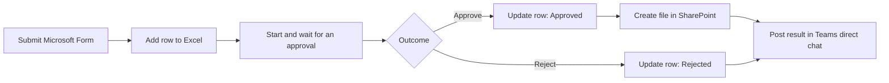

# Day 1 — Power Automate: เปลี่ยนคำขอให้เป็นงานที่ติดตามได้

วันนี้เราจะสร้าง workflow รับคำของานแบบทีละขั้นสำหรับผู้เริ่มต้น แต่ละ connector มีผลที่เห็นและตรวจได้ทันที ก่อนนำทุกส่วนมาต่อเป็นเส้นทางเดียวตั้งแต่รับคำขอจนแจ้งผล

ทุกคนใช้ไฟล์ Excel ของตัวเองใน `OneDrive for Business` เป็นที่เก็บ workbook ที่เตรียมไว้ โดยไม่ต้องสร้าง flow แยกสำหรับ OneDrive

> **License:** เส้นทาง hands-on ใช้ Standard connectors ได้แก่ `Office 365 Outlook`, `Microsoft Forms`, `Excel Online (Business)`, `Standard approvals`, `SharePoint` และ `Microsoft Teams` รวมถึง Built-in actions ของ Power Automate ไม่ใช้ Premium connector บัญชี สิทธิ์ และ policy ของบริการที่เกี่ยวข้องต้องผ่าน readiness check ก่อนอบรม

## สิ่งที่ต้องเตรียม

- เข้าใช้งาน [Power Automate](https://make.powerautomate.com), `Microsoft Forms`, `Outlook`, `OneDrive for Business` และ `Microsoft Teams` ได้
- ดาวน์โหลด [task-request-tracker.xlsx](./files/task-request-tracker.xlsx) และอัปโหลดไว้ในโฟลเดอร์ `PowerAutomateTraining` ของ OneDrive
- ใช้อีเมลของตัวเองเป็นผู้ขอและผู้อนุมัติระหว่างการฝึก หรือใช้อีเมลฝึกที่วิทยากรกำหนด
- เปิดไฟล์ Excel เพื่อตรวจว่า table ชื่อ `RequestsTable` แล้วปิดไฟล์ก่อนทดสอบ flow
- ใช้ SharePoint training site ที่วิทยากรระบุ ซึ่งมี document library และสิทธิ์เขียนพร้อมแล้ว
- ตรวจว่า Teams `Workflows` app ใช้งานได้ และใช้ direct chat ตามเส้นทางที่วิทยากร rehearsal แล้ว

> **⚠️ Note:** อย่าแก้ไฟล์ Excel ระหว่างที่ flow กำลังเขียนข้อมูล การเปลี่ยนแปลงจาก connector อาจใช้เวลาประมาณ 30 วินาทีจึงจะแสดงครบ

## เส้นทางการฝึกหลัก

1. [ส่งการแจ้งเตือนงานครั้งแรก](./exercises/01-first-task-notification/README.md) — Outlook
2. [รับและบันทึกคำของาน](./exercises/02-collect-and-record-requests/README.md) — Forms และ Excel
3. [ขออนุมัติและอัปเดตคำขอ](./exercises/03-ask-for-a-decision/README.md) — Standard approvals และ Condition
4. [เก็บคำขอที่อนุมัติแล้วใน SharePoint](./exercises/07-archive-approved-request-in-sharepoint/README.md) — Approved เท่านั้น
5. [แจ้งผลผู้ขอผ่าน Microsoft Teams](./exercises/08-notify-requester-in-teams/README.md) — Approved และ Rejected
6. [ทำความเข้าใจและรับมือข้อผิดพลาด](./exercises/05-understand-and-recover-from-errors/README.md) — Run history และ Run After

## แบบฝึกหัดเสริม / Take-home

- [ส่งสรุปงานค้างประจำวัน](./exercises/04-daily-pending-summary/README.md) — Scheduled flow สำหรับศึกษาต่อ
- [ออกแบบ Automation สำหรับงานของเรา](./exercises/06-automate-my-task/README.md) — ใช้ [Automation Canvas](./files/automation-canvas.md) หลังชั้นเรียน

## ตารางเวลา

| Time | Activity |
|---|---|
| 09:00–09:30 | Automation basics, Trigger, Action, Connector และ governance ที่แทรกในงาน |
| 09:30–10:15 | Outlook: first Instant cloud flow และตรวจ Inbox |
| 10:15–10:30 | Break |
| 10:30–11:30 | Forms และ Excel: ส่งหนึ่งคำขอและเพิ่มหนึ่งแถวใน `RequestsTable` |
| 11:30–12:00 | Approvals: เพิ่ม `Start and wait for an approval` |
| 12:00–13:00 | Lunch |
| 13:00–13:30 | สร้าง Approve/Reject Condition และอัปเดตแถวเดิม |
| 13:30–14:00 | SharePoint: สร้าง text file สำหรับคำขอ Approved |
| 14:00–14:30 | Teams: ส่งผลไปยัง direct chat |
| 14:30–14:45 | Break |
| 14:45–15:15 | ทดสอบ workflow ครบทั้ง Approved และ Rejected |
| 15:15–15:35 | Live error recovery ด้วย Run history และ Run After |
| 15:35–15:50 | Instructor demonstration และ discussion: AI Builder |
| 15:50–16:00 | Review และ Q&A |

รวม 330 นาทีสำหรับ instruction/activity, พัก 30 นาที และ lunch 60 นาที

## ไฟล์ประกอบ

- [ตัวอย่างคำของาน](./files/sample-requests.md)
- [Excel tracker](./files/task-request-tracker.xlsx)
- [Automation Canvas — optional/take-home](./files/automation-canvas.md)

## Microsoft Learn references

- [Microsoft Forms connector](https://learn.microsoft.com/en-us/connectors/microsoftforms/)
- [Office 365 Outlook connector](https://learn.microsoft.com/en-us/connectors/office365/)
- [Excel Online (Business) connector and limitations](https://learn.microsoft.com/en-us/connectors/excelonlinebusiness/)
- [OneDrive for Business connector](https://learn.microsoft.com/en-us/connectors/onedriveforbusiness/)
- [Standard approvals connector](https://learn.microsoft.com/en-us/connectors/approvals/)
- [SharePoint connector](https://learn.microsoft.com/en-us/connectors/sharepointonline/)
- [Microsoft Teams connector](https://learn.microsoft.com/en-us/connectors/teams/)
- [Send a message in Teams using Power Automate](https://learn.microsoft.com/en-us/power-automate/teams/send-a-message-in-teams)

## ภาพรวม Workflow

เมื่อจบวันนี้ ผู้เรียนจะมี workflow รุ่นแรกที่ทดสอบครบสองผลลัพธ์ รู้ว่าผลใดเกิดใน Excel, SharePoint และ Teams และใช้ Run history ตรวจสอบเมื่อ flow ไม่เป็นไปตามคาดได้
