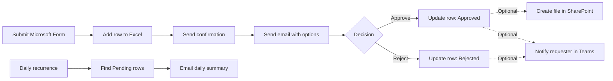

# Day 1 — Power Automate: เปลี่ยนคำขอให้เป็นงานที่ติดตามได้

วันนี้เราจะค่อย ๆ สร้างระบบรับคำของานแบบง่าย ตั้งแต่กดส่งอีเมลครั้งแรก รับข้อมูลจาก `Microsoft Forms` บันทึกลง `Excel Online (Business)` ขอผลตัดสินใจผ่าน `Outlook` และส่งสรุปงานค้างประจำวัน

ทุกคนจะใช้ไฟล์ Excel ของตัวเองใน `OneDrive for Business` จึงไม่ต้องสร้าง `SharePoint site` หรือ Power Platform environment ใหม่
และมีแบบฝึกหัดเสริมใช้ SharePoint และ Microsoft Teams เฉพาะเมื่อ Client IT ยืนยันว่าสามารถใช้งานได้

> **License:** Core path ใช้ Standard connectors ได้แก่ `Microsoft Forms`, `Office 365 Outlook` และ `Excel Online (Business)` ส่วนแบบฝึกหัดเสริมใช้ Standard connectors `SharePoint` และ `Microsoft Teams` รวมถึง Built-in actions ของ Power Automate ไม่ใช้ Premium connector อย่างไรก็ตาม สิทธิ์ Microsoft 365, OneDrive, mailbox, SharePoint, Teams และการสร้าง cloud flow ต้องตรวจสอบก่อนเริ่มอบรม

## สิ่งที่ต้องเตรียม

- เข้าใช้งาน [Power Automate](https://make.powerautomate.com) ได้
- เข้าใช้งาน `Microsoft Forms`, `Outlook` และ `OneDrive for Business` ได้
- ดาวน์โหลด [task-request-tracker.xlsx](./files/task-request-tracker.xlsx) และอัปโหลดไว้ในโฟลเดอร์ `PowerAutomateTraining` ของ OneDrive
- ใช้อีเมลของตัวเองเป็นผู้ขอและผู้อนุมัติระหว่างการฝึก หรือใช้อีเมลฝึกที่วิทยากรกำหนด
- เปิดไฟล์ Excel เพื่อตรวจชื่อ table แล้วปิดไฟล์ก่อนทดสอบ flow

### เตรียมเพิ่มเฉพาะแบบฝึกหัดเสริม

- **SharePoint:** วิทยากรแจ้ง site ที่มี default `Documents` library และผู้เรียนมี Edit permission
- **Microsoft Teams:** ผู้เรียนเข้า Teams ได้ และ Client IT ยืนยันว่า `Workflows` app ถูกตั้งเป็น Allow
- ไม่ต้องสร้าง SharePoint list, site รายบุคคล, Team หรือ channel สำหรับเส้นทางเสริมแบบง่าย

> **⚠️ Note:** อย่าแก้ไฟล์ Excel ระหว่างที่ flow กำลังเขียนข้อมูล การเปลี่ยนแปลงที่เกิดขึ้นจาก connector อาจใช้เวลาประมาณ 30 วินาทีจึงจะแสดงครบ

## Learning path

1. [ส่งการแจ้งเตือนงานครั้งแรก](./exercises/01-first-task-notification/README.md)
2. [รับและบันทึกคำของาน](./exercises/02-collect-and-record-requests/README.md)
3. [ขอผลตัดสินใจทางอีเมล](./exercises/03-ask-for-a-decision/README.md)
4. [ส่งสรุปงานค้างประจำวัน](./exercises/04-daily-pending-summary/README.md)
5. [ทำความเข้าใจและรับมือข้อผิดพลาด](./exercises/05-understand-and-recover-from-errors/README.md)
6. [ออกแบบ Automation สำหรับงานของเรา](./exercises/06-automate-my-task/README.md)

### Optional extensions

ทำหลังแบบฝึกหัดที่ 3 หรือใช้เป็นกิจกรรมเสริมเมื่อ Client IT ผ่าน readiness check แล้ว กิจกรรมเหล่านี้ไม่ใช่เกณฑ์ผ่านของ core path

7. [เก็บคำขอที่อนุมัติแล้วใน SharePoint](./exercises/07-archive-approved-request-in-sharepoint/README.md) — ใช้ site เดียว, default `Documents` library และโฟลเดอร์แยกของผู้เรียน
8. [แจ้งผลผู้ขอผ่าน Microsoft Teams](./exercises/08-notify-requester-in-teams/README.md) — ส่ง direct chat ผ่าน Flow bot โดยไม่ต้องสร้าง Team หรือ channel

## ไฟล์ประกอบ

- [ตัวอย่างคำของาน](./files/sample-requests.md)
- [Automation Canvas](./files/automation-canvas.md)
- [Excel tracker](./files/task-request-tracker.xlsx)

## Microsoft Learn references

- [Microsoft Forms connector](https://learn.microsoft.com/en-us/connectors/microsoftforms/)
- [Office 365 Outlook connector](https://learn.microsoft.com/en-us/connectors/office365/)
- [Excel Online (Business) connector and limitations](https://learn.microsoft.com/en-us/connectors/excelonlinebusiness/)
- [SharePoint connector](https://learn.microsoft.com/en-us/connectors/sharepointonline/)
- [Microsoft Teams connector](https://learn.microsoft.com/en-us/connectors/teams/)
- [Send a message in Teams using Power Automate](https://learn.microsoft.com/en-us/power-automate/teams/send-a-message-in-teams)
- [Standard approvals connector](https://learn.microsoft.com/en-us/connectors/approvals/)
- [Power Automate licensing FAQ](https://learn.microsoft.com/en-us/power-platform/admin/power-automate-licensing/faqs)

## ภาพรวม Workflow

เมื่อจบวันนี้ เราจะมี workflow รุ่นแรกที่ทดสอบได้ พร้อมรู้ว่าจะดูผลสำเร็จ ความผิดพลาด และจุดที่ควรปรับก่อนนำไปใช้กับงานจริงอย่างไร
