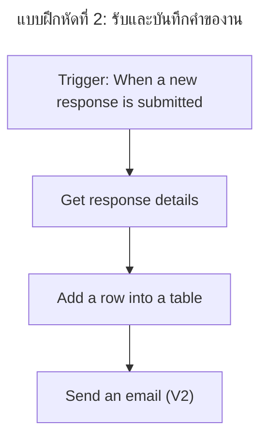

# แบบฝึกหัดที่ 2: รับและบันทึกคำของาน

เราจะสร้างแบบฟอร์มรับคำของาน แล้วให้ Power Automate บันทึกคำขอลงสมุดบันทึก Excel ของเราโดยอัตโนมัติ พร้อมส่งอีเมลยืนยันกลับไปหาผู้ขอ

> **License:** ใช้ `Microsoft Forms`, `Excel Online (Business)` และ `Office 365 Outlook` ซึ่งเป็น Standard connectors ต้องตรวจสอบสิทธิ์ก่อนเริ่มอบรม

## Workflow ที่เราจะสร้าง



## Prerequisites

- อัปโหลด [task-request-tracker.xlsx](/downloads/task-request-tracker.xlsx?v=20260920-1) ไปยัง `OneDrive for Business/PowerAutomateTraining/`
- คลิกเปิด workbook แล้วตรวจ worksheet และ table ตามขั้นตอนนี้:
   1. ดูแท็บ worksheet ด้านล่างของหน้าต่าง Excel แล้วเลือก `Requests` หากไม่เห็น ให้เลือก **All Sheets** เพื่อตรวจสอบอีกครั้ง หากยังไม่พบ ให้หยุดและตรวจว่าเปิดไฟล์ถูกต้อง
   2. คลิกเซลล์ใดก็ได้ภายในข้อมูลของ `Requests` แล้วดูแท็บ **Table Design** (หรือ **Table**) บน Ribbon ในส่วน **Properties** ตรวจว่า **Table Name** เป็น `RequestsTable` ตรงตามนี้ทุกตัวอักษร หากไม่เห็นแท็บดังกล่าว แสดงว่ายังไม่ได้คลิกภายใน table หรือเปิดไฟล์ไม่ถูกต้อง
- ใช้ Form หนึ่งชุดกับ workbook ส่วนตัวหนึ่งไฟล์ เพื่อให้ `Response Id` ไม่ชนกับข้อมูลจาก Form อื่น
- ปิด workbook ก่อนทดสอบ flow และส่งคำขอทีละรายการ รอ run จบก่อนส่งรายการต่อไป

---

## Practice 1: สร้างแบบฟอร์มรับคำของาน

**Primary target:** สร้าง Microsoft Form ที่เก็บข้อมูลตาม schema ของ tracker เพื่อให้ flow นำคำตอบไปจับคู่กับ Excel ได้

1. เปิด `Microsoft Forms` แล้วเลือก **New Form** หากพบแผง **Draft with Copilot** ให้เลือก **Close** เพื่อสร้างคำถามด้วยตัวเอง
2. ตั้งชื่อ Form:

   ```text
   Task Request - [Your Name]
   ```

3. เลือก **Quick start with** เพื่อเลือกชนิดคำถามแรก หลังจากนั้นใช้ **Add new question** เพิ่มคำถามตามตารางนี้
   1. ตรวจให้ทุกข้อเปิด **Required**
   2. สำหรับ Description ให้เปิด **Long answer**
   3. ส่วน Category ใช้ **Add option** และเพิ่มตัวเลือกจนครบ 4 ตัวเลือก และไม่เปิด **Multiple answers**

   | No. | Type | Question | Options |
   |---|---|---|---|
   | 1 | Text | Task title | Short answer |
   | 2 | Text | Description | Long answer |
   | 3 | Text | Requester email | Short answer |
   | 4 | Choice | Category | Operations, Finance, HR, IT Support |
   | 5 | Date | Needed by | — |

4. เลือก **Preview** แล้วทดสอบส่งข้อมูล 1 รายการจาก [ตัวอย่าง task request](../resources/sample-requests.md)

### Checkpoint

- Form เก็บคำตอบได้ครบ 5 ค่า และมี response ทดสอบอย่างน้อย 1 รายการ

---

## Practice 2: บันทึกคำขอลง Excel

**Primary target:** เชื่อม Forms กับ Excel table เพื่อให้ทุก response ใหม่กลายเป็นแถวที่มีสถานะ `Pending`

1. ใน Power Automate เลือก **Create** > **Automated cloud flow**
2. ตั้งชื่อ flow:

   ```text
   Record Task Request - [Your Name]
   ```

3. เลือก trigger `When a new response is submitted` ของ Microsoft Forms
4. แล้วเลือก **Create**
5. ใน **Form Id** เลือก Form ที่สร้างใน Practice 1 หากไม่พบ Form ในเมนู ให้ตรวจ connection ที่แสดงใต้ช่อง **Form Id** แล้วทำตามขั้นตอนนี้:
   1. เลือก **Change connection reference**
   2. เลือก connection ที่มีอยู่ หรือเลือก **+ Add new connection**
   3. หากเลือก **+ Add new connection** ให้ Sign in ด้วยบัญชี Microsoft 365 ของผู้เรียน แล้วรอจนระบบสร้าง connection สำเร็จ
   4. กลับมาที่ trigger แล้วเปิดเมนู **Form Id** อีกครั้ง จากนั้นเลือก Form ที่สร้างไว้ใน Practice 1

   

6. เพิ่ม action `Get response details` แล้วเลือก Form เดิม
7. ใน **Response Id** เลือก Dynamic content `Response Id` จาก trigger
8. เพิ่ม action `Add a row into a table` ของ Excel Online (Business)
9. เลือกตำแหน่งตามนี้:

   - **Location:** `OneDrive for Business`
   - **Document Library:** เลือกคลังเอกสารส่วนตัวที่มี workbook ชื่ออาจต่างตามภาษา เช่น `เอกสาร` ในบัญชีที่ทดสอบ ให้ยืนยันด้วยการเปิด **File** แล้วพบโฟลเดอร์ของเรา
   - **File:** เลือกไอคอนโฟลเดอร์ (**Open folder**) แล้วใช้ลูกศรเข้า `PowerAutomateTraining` และเลือก `task-request-tracker.xlsx` ไม่พิมพ์ path โดยเดา
   - **Table:** `RequestsTable`

10. หลังเลือก Table แล้วรอให้ schema โหลด จากนั้นเลือก **Advanced parameters** > **Show all** เพื่อแสดงคอลัมน์ ตรวจว่า token ปรากฏในช่องก่อนเปลี่ยนไปช่องถัดไป แล้วจับคู่ค่าลงแต่ละคอลัมน์ โดยเลือก `Response Id` จาก trigger และเลือกคำตอบของ Form จาก `Get response details` ผ่าน Dynamic content; พิมพ์เฉพาะ `Pending` เป็นข้อความคงที่:

   | Excel column | Value |
   |---|---|
   | RequestId | `Response Id` |
   | Title | `Task title` |
   | Description | `Description` |
   | RequesterEmail | `Requester email` |
   | Category | `Category` |
   | NeededBy | `Needed by` |
   | Status | `Pending` |
   | Decision | เว้นว่าง |

11. เลือก **Save**
12. ส่ง Form ใหม่ 1 ครั้งหลังบันทึก flow แล้วรอให้ flow ทำงานเสร็จ คำตอบที่ส่งก่อนสร้าง flow ใน Practice 1 ไม่ใช่รายการทดสอบนี้
13. เปิด workbook หลัง run สำเร็จ และตรวจแถวใหม่

### Checkpoint

- มีแถวใหม่ที่ `RequestId` ตรงกับ Forms response ID และ `Status` เป็น `Pending`

> **⚠️ Note:** หากไม่พบไฟล์หรือ table ให้ตรวจว่าไฟล์อยู่ใน OneDrive ของบัญชีเดียวกับ connection และ table ชื่อ `RequestsTable`

---

## Practice 3: ส่งอีเมลยืนยันผู้ขอ

**Primary target:** เพิ่มอีเมลยืนยันหลังบันทึกสำเร็จ เพื่อให้ผู้ขอทราบว่าระบบรับคำขอแล้ว

1. กลับไปแก้ flow `Record Task Request - [Your Name]`
2. หลัง `Add a row into a table` เพิ่ม `Send an email (V2)`
3. กำหนดค่า:

   - **To:** `Requester email`
   - **Subject:** `Request received: ` + `Task title`
   - **Body:** แสดง `Response Id`, `Task title`, `Needed by` และข้อความ `Status: Pending`

4. เลือก **Save** แล้วส่ง Form ใหม่อีก 1 ครั้ง
5. ตรวจ Excel ก่อน แล้วจึงตรวจอีเมลยืนยัน

### Checkpoint

- คำขอหนึ่งรายการสร้าง Excel row หนึ่งแถว และส่งอีเมลยืนยันหนึ่งฉบับ

> **💡 Tip:** ลำดับ action เหมือนลำดับในใบรับงาน เราบันทึกข้อมูลให้สำเร็จก่อนจึงส่งใบยืนยัน

---

## Summary

เราได้สร้าง Automated cloud flow ที่รับ response, ดึงรายละเอียด, บันทึก Excel และยืนยันผู้ขอแบบ end-to-end

ขั้นตอนถัดไป → [ขออนุมัติและอัปเดตคำขอ](./03-ask-for-a-decision.md)
