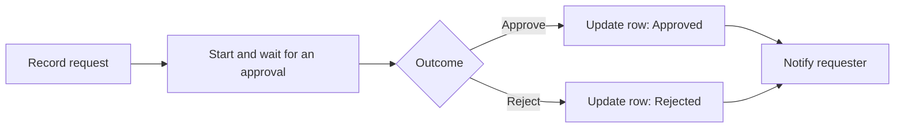

# แบบฝึกหัดที่ 3: ขออนุมัติและอัปเดตคำขอ

เราจะต่อยอด flow เดิมให้สร้าง approval หนึ่งรายการ รอผล `Approve` หรือ `Reject` แล้วอัปเดตแถวเดิมใน Excel จาก `Outcome`

> **License:** ใช้ `Standard approvals`, `Office 365 Outlook` และ `Excel Online (Business)` ซึ่งเป็น Standard connectors

## Prerequisites

- Flow `Record Task Request - [Your Name]` จากแบบฝึกหัดที่ 2 ทำงานสำเร็จ
- กำหนดอีเมลผู้อนุมัติสำหรับการฝึก โดยใช้อีเมลของตัวเองหรือบัญชีที่วิทยากรจัดให้

## Workflow ที่เราจะสร้าง



---

## Practice 1: สร้าง approval หนึ่งรายการ

**Primary target:** รอรับผลจาก `Start and wait for an approval` เพื่อให้ flow มีค่า `Outcome` สำหรับตัดสินใจ

1. เปิด flow `Record Task Request - [Your Name]`
2. หลัง action ที่เราส่งอีเมลยืนยัน เพิ่ม action `Start and wait for an approval` จาก `Standard approvals`
3. กำหนดค่า:

   - **Approval type:** `Approve/Reject - First to respond`
    - **Title:** วางข้อความนี้ แล้วแทนที่ค่าที่อยู่ในวงเล็บเหลี่ยมด้วย Dynamic content ที่มีชื่อเดียวกัน:

       ```text
       Decision needed: [Task title]
       ```

   - **Assigned to:** พิมพ์อีเมลผู้อนุมัติสำหรับการฝึก แล้วกด **Tab** ตรวจว่าอีเมลกลายเป็นรายการผู้รับในช่อง
    - **Details:** วางข้อความนี้ แล้วแทนที่ค่าที่อยู่ในวงเล็บเหลี่ยมด้วย Dynamic content ที่มีชื่อเดียวกัน:

       ```text
       Description: [Description]
       Category: [Category]
       Needed by: [Needed by]
       Requester email: [Requester email]
       Response Id: [Response Id]
       ```

4. เลือก **Save**
5. ส่ง Form ใหม่ 1 ครั้ง แล้วเปิด **Run history** ของ flow ตรวจว่า action `Start and wait for an approval` แสดง **Waiting**
6. เปิด Outlook ของผู้อนุมัติ แล้วเปิดอีเมลหัวข้อ `Decision needed: ...` ตรวจข้อมูลคำขอและ `Request ID`

### Checkpoint

- เห็น approval ที่มีปุ่ม `Approve` และ `Reject` และ flow รออยู่ที่ action นี้

ก่อนเริ่ม Practice 2:

- [ ] เลือก **Approve** ในอีเมล
- [ ] ใส่ **Comments** ได้ตามต้องการ แล้วเลือก **Submit**
- [ ] ตรวจว่า approval แสดง **Approved** และรอให้ run จบ
- [ ] ยอมรับได้หากแถวยังเป็น `Pending` เพราะยังไม่ได้เพิ่ม `Update a row`
- [ ] หลังแก้ไขและบันทึก flow ให้ส่ง Form ใหม่เสมอ

> **💡 Comparison:** `Send email with options` เหมาะกับคำตอบทางอีเมลแบบง่าย ส่วน `Start and wait for an approval` ให้ output และประวัติสำหรับกระบวนการอนุมัติโดยตรง วันนี้เราใช้แบบหลังเป็นเส้นทางหลัก

---

## Practice 2: แยกเส้นทางด้วย Condition

**Primary target:** ตรวจค่า `Outcome` ของ approval เพื่อให้ flow เลือกเส้นทาง Approved หรือ Rejected และอัปเดต `RequestId` ที่ถูกต้อง

1. หลัง `Start and wait for an approval` เพิ่ม Built-in action `Condition`
2. เลือก Dynamic content `Outcome` จาก `Start and wait for an approval` ในช่องซ้าย เลือก `is equal to` แล้วพิมพ์ `Approve` ในช่องขวา โดยใช้ตัวพิมพ์ให้ตรง:

   ```text
   Outcome is equal to Approve
   ```
   ```text
   is equal to
   ```
   ```text
    Approve
   ```

3. ในกิ่งฝั่ง **True** (บางหน้าจอใช้ **If yes**) เพิ่ม `Update a row` ของ Excel Online (Business)
4. เลือก workbook และ `RequestsTable` เดิม
5. กำหนด **Key Column** เป็น `RequestId`
6.  **Key Value** เป็น Dynamic content `Response Id` จาก Forms trigger ไม่ใช่ Approval ID
7. ที่ **Advanced parameters** เลือก **Show all** แล้วกำหนดค่าในเส้นทาง **True** (บางหน้าจอใช้ **If yes**) ปล่อยคอลัมน์อื่นว่าง เพราะเราต้องการอัปเดตเฉพาะสองคอลัมน์นี้:

    - **Status:**

       ```text
       Approved
       ```

    - **Decision:**

       ```text
       Approve
       ```

8. คลิกขวาที่ action `Update a row` ในเส้นทาง **True** แล้วเลือก **Copy action** จากเมนู

   

9. คลิกขวาที่ปุ่ม **+** ในเส้นทาง **False** (บางหน้าจอใช้ **If no**) แล้วเลือก **Paste an action** จากเมนู

   

10. ใน `Update a row` ที่วางในเส้นทาง **False** กำหนดค่าต่อไปนี้ โดยคงค่า workbook, table, **Key Column** และ **Key Value** เดิมไว้:

    - **Status:**

       ```text
       Rejected
       ```

    - **Decision:**

       ```text
       Reject
       ```
   11. เลือก **Save**

### Checkpoint

- Condition มี 2 เส้นทางจาก `Outcome` และทั้งสองเส้นทางค้นหาแถวด้วย `RequestId` ค่าเดียวกับ Forms response ID

> **💡 Tip:** Condition เหมือนพนักงานที่เคาน์เตอร์ อ่านผลอนุมัติแล้วส่งเอกสารไปช่องที่ถูกต้อง

---

## Practice 3: แจ้งผลและทดสอบทั้งสองเส้นทาง

**Primary target:** ยืนยันผลปลายทางทั้ง Approved และ Rejected เพื่อพิสูจน์ว่า flow อัปเดตแถวถูกต้อง

1. ต่อจาก `Update a row` ในแต่ละเส้นทาง เพิ่ม `Send an email (V2)`
2. เลือก Dynamic content `Requester email` จาก `Get response details` เป็นผู้รับ แล้วกำหนดหัวข้อและเนื้อหาตามแต่ละเส้นทาง โดยแทนที่ค่าที่อยู่ในวงเล็บเหลี่ยมด้วย Dynamic content ที่มีชื่อเดียวกัน
3. ใน **True** (บางหน้าจอใช้ **If yes**) วางค่า:

    - **Subject:**

       ```text
       Decision for: [Task title]
       ```

    - **Body:**

       ```text
       Response Id: [Response Id]
       Decision: Approved
       ```

4. ใน **False** (บางหน้าจอใช้ **If no**) วางค่า:

    - **Subject:**

       ```text
       Decision for: [Task title]
       ```

    - **Body:**

       ```text
       Response Id: [Response Id]
       Decision: Rejected
       ```

5. เลือก **Save**
6. ส่ง Form ครั้งที่ 1 แล้วเลือก `Approve`
7. รอ run สำเร็จและตรวจ Excel กับอีเมล
8. ส่ง Form ครั้งที่ 2 แล้วเลือก `Reject`
9. รอ run สำเร็จและตรวจ Excel กับอีเมล

### Checkpoint

- มีรายการหนึ่งเป็น `Approved` และอีกหนึ่งรายการเป็น `Rejected` โดยอัปเดตคนละ `RequestId`

---

## Summary

เราได้สร้าง workflow ที่รอผล approval แยกเส้นทาง อัปเดตแถวเดิม และแจ้งผลผู้ขอครบทั้งสองกรณี

ขั้นตอนถัดไปในเส้นทางหลัก → [แจ้งผลผู้ขอผ่าน Microsoft Teams](./08-notify-requester-in-teams.md)

ช่วง 13:30 ให้เปิดเพียงกิจกรรมที่วิทยากรประกาศ:

- [ทบทวนและพิสูจน์การทำงานของ Approve/Reject](./07-core-approval-reinforcement.md)
- [เก็บคำขอ Approved ใน SharePoint — Optional](./07-archive-approved-request-in-sharepoint.md)
