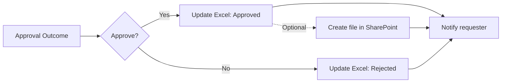

---
prev:
  text: "3 · ขออนุมัติและอัปเดต"
  link: /exercises/03-ask-for-a-decision
next:
  text: "8 · แจ้งผลผ่าน Teams"
  link: /exercises/08-notify-requester-in-teams
---

# แบบฝึกหัดเสริมที่ 7: เก็บคำขอที่อนุมัติแล้วใน SharePoint

> **Optional / Instructor-selected:** ทำกิจกรรมนี้เมื่อวิทยากรประกาศใช้เส้นทาง SharePoint เท่านั้น หากวิทยากรเลือกเส้นทางทบทวน Approval ให้เปิด [ทบทวนและพิสูจน์การทำงานของ Approve/Reject](./07-core-approval-reinforcement.md) แทน

เราจะต่อยอดเส้นทาง `True` (หรือ `If yes` ในหน้าจอเดิม) จากแบบฝึกหัดที่ 3 ให้สร้างไฟล์สรุปคำขอใน SharePoint เมื่อผลเป็น `Approved` เท่านั้น กิจกรรมนี้เป็นส่วนเสริมและไม่เป็นเงื่อนไขการผ่าน Day 1

> **License:** ใช้ SharePoint connector ซึ่งเป็น Standard connector ใน Power Automate ไม่ใช้ Premium connector, custom connector, app registration หรือ on-premises data gateway บัญชี สิทธิ์ connection, Conditional Access และ DLP policy ยังต้องผ่านการตรวจขององค์กร

> **💡 Analogy:** SharePoint document library เหมือนตู้เอกสารกลางของทีม ส่วนโฟลเดอร์ชื่อเราเป็นถาดที่ติดป้ายไว้ชัดเจน

## เลือกเส้นทางเตรียม SharePoint หนึ่งเส้นทาง

เปิดเฉพาะเส้นทางที่ตรงกับสถานการณ์ของห้องเรียน ไม่ต้องอ่านหรือทำอีกเส้นทางหนึ่ง

1. [Route A — สร้างและตรวจ SharePoint site ของตนเอง](./07a-create-and-validate-own-site.md)
2. [Route B — ตรวจและใช้ SharePoint site ที่ IT เตรียมให้](./07b-validate-it-provided-site.md)

วิทยากรสามารถส่งลิงก์ของ Route A หรือ Route B ให้ผู้เรียนโดยตรง

ทั้งสองเส้นทางต้องได้ Readiness record เดียวกันก่อนทำส่วนถัดไป:

```text
Site Address:
Document library:
Learner folder:
Permission check: Upload / Open / Delete passed
```

> **⚠️ Stop:** หากยังไม่มี site ที่ใช้งานได้ หรือทดสอบ Upload / Open / Delete ไม่ผ่าน ให้หยุดกิจกรรม SharePoint แล้วไปที่ [เส้นทางทบทวน Approval](./07-core-approval-reinforcement.md) หรือ [แบบฝึกหัดที่ 8: Teams](./08-notify-requester-in-teams.md) ตามที่วิทยากรแจ้ง ห้ามเปลี่ยน connection ไปใช้บัญชีของผู้อื่น

## Workflow ส่วนเสริม



---

## Practice 1: สร้างไฟล์เมื่ออนุมัติ

**Primary target:** เพิ่ม `Create file` ในเส้นทาง Approved และ map ข้อมูลคำขอเป็นไฟล์สรุปที่อ่านได้

### Prerequisites

- Flow `Record Task Request - [Your Name]` จาก [แบบฝึกหัดที่ 3](./03-ask-for-a-decision.md) ทำงานครบทั้ง Approved และ Rejected
- ทำ Route A หรือ Route B สำเร็จและบันทึก Readiness record แล้ว
- ใช้ข้อมูลสมมติเท่านั้น

1. เปิด flow `Record Task Request - [Your Name]`
2. ในเส้นทาง **True** (หรือ **If yes** ในหน้าจอเดิม) หา action `Update a row` ที่ตั้ง `Status` เป็น `Approved`
3. เพิ่ม action ใหม่ถัดจาก action นั้น และก่อน `Send an email (V2)` ที่แจ้งผล Approved โดยเก็บอีเมลเดิมไว้
4. ค้นหา connector `SharePoint` แล้วเลือก action `Create file`
5. กำหนดค่า:

   - **Site Address:** ใช้ค่าจาก Readiness record หาก site ไม่อยู่ในรายการ ให้เลือก **Enter custom value** แล้ววาง URL ของ site โดยไม่รวม path ของ library หรือไฟล์
   - **Folder Path:** เลือกไอคอน folder (**Open folder**) แล้วเลือก library และโฟลเดอร์จาก Readiness record; `Documents` อาจปรากฏใน picker ว่า `Shared Documents` ให้เลือกจาก picker แทนการเดา path
   - **File Name:** พิมพ์ `Request-` ตามด้วย Dynamic content `Response Id` แล้วพิมพ์ `.txt`
   - **File Content:** ใช้ข้อความด้านล่างและแทรก Dynamic content ในตำแหน่งที่กำหนด

   ```text
   RequestId: [Response Id]
   Title: [Task title]
   Requester: [Requester email]
   NeededBy: [Needed by]
   Status: Approved
   Decision: Approve
   ```

6. ตรวจว่า `Create file` อยู่ในเส้นทาง **True** (หรือ **If yes**) เท่านั้น
7. เลือก **Save**

### Expected output

- เมื่อเลือก Approve flow จะสร้างไฟล์ `Request-[Response Id].txt` ในโฟลเดอร์ของผู้เรียน

### Checkpoint

- `Site Address`, `Folder Path`, `File Name` และ `File Content` ไม่มีช่องบังคับที่ว่าง
- เส้นทาง Rejected ไม่มี action `Create file`

---

## Practice 2: พิสูจน์ทั้งสองเส้นทาง

**Primary target:** ยืนยันว่า Approved สร้างไฟล์ และ Rejected ไม่สร้างไฟล์

1. ส่ง Form ใหม่หนึ่งครั้งและจด `Response Id`
2. เลือก `Approve` ใน approval
3. รอให้ run เป็น `Succeeded`
4. เปิดโฟลเดอร์ของตนใน SharePoint แล้วเปิด `Request-[Response Id].txt`
5. เทียบ `RequestId`, `Title`, `Requester`, `NeededBy`, `Status` และ `Decision` กับคำขอที่ส่ง
6. ส่ง Form ใหม่อีกหนึ่งครั้งและจด `Response Id` ใหม่
7. เลือก `Reject` ใน approval
8. รอให้ run เป็น `Succeeded`
9. ตรวจว่าไม่มีไฟล์ `Request-[Response Id ใหม่].txt`

### Expected output

- Approved สร้างไฟล์ที่มีข้อมูลตรงกับคำขอ
- Rejected อัปเดต Excel และส่งผลตาม flow เดิม โดยไม่สร้างไฟล์ SharePoint

### Checkpoint

- เห็นไฟล์ของ Approved หนึ่งไฟล์ และไม่พบไฟล์สำหรับ `Response Id` ของ Rejected

## Troubleshooting

| อาการ | ตรวจสอบและแก้ไข |
|---|---|
| ไม่เห็น site ใน `Site Address` | เปิด site ใน browser ด้วยบัญชีเดียวกันก่อน แล้วใช้ **Enter custom value** วาง URL จาก Readiness record |
| เลือก folder ไม่ได้ | ยืนยันชื่อ library และเปิดโฟลเดอร์ด้วย browser; ใช้ path ที่วิทยากรให้เมื่อ picker ไม่แสดง |
| `Access denied` หรือ `403` | หยุดทดสอบและให้ IT ตรวจ Edit permission; อย่าเปลี่ยน connection ไปใช้บัญชีผู้อื่น |
| ไฟล์ชื่อซ้ำ | ส่ง Form ใหม่และตรวจว่ากำลังใช้โฟลเดอร์ของตน ลบเฉพาะไฟล์ทดสอบของตนก่อนลองใหม่ |
| Run สำเร็จแต่ยังไม่เห็นไฟล์ | Refresh library รอสักครู่ แล้วเทียบ `Response Id` กับชื่อไฟล์ |
| Rejected สร้างไฟล์ด้วย | ย้าย `Create file` กลับเข้าเส้นทาง **True** (หรือ **If yes**) ใต้ action ที่อัปเดต Approved |

## Summary

เราได้เพิ่มตู้เอกสารกลางเป็นทางเลือกให้เส้นทาง Approved โดยไม่เปลี่ยนผลของเส้นทางหลัก ผู้เรียนที่ข้ามกิจกรรมนี้ยังทำ Teams และแบบฝึกหัดหลักถัดไปได้ตามปกติ

## Microsoft Learn references

- [Create a team site in SharePoint](https://support.microsoft.com/office/create-a-team-site-in-sharepoint-ef10c1e7-15f3-42a3-98aa-b5972711777d)
- [Manage site creation in SharePoint](https://learn.microsoft.com/sharepoint/manage-site-creation)
- [Sharing and permissions in the SharePoint modern experience](https://learn.microsoft.com/sharepoint/modern-experience-sharing-permissions)
- [SharePoint connector — Standard classification and Create file action](https://learn.microsoft.com/en-us/connectors/sharepointonline/)

กลับเข้าสู่เส้นทางหลัก → [แจ้งผลผ่าน Microsoft Teams](./08-notify-requester-in-teams.md)

กลับไป → [เส้นทางการฝึก Day 1](../index.md)
