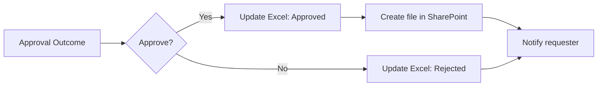

# แบบฝึกหัดที่ 7: เก็บคำขอที่อนุมัติแล้วใน SharePoint

เราจะต่อยอดแขนง `If yes` จากแบบฝึกหัดที่ 3 ให้สร้างไฟล์สรุปคำขอใน SharePoint เมื่อผลเป็น `Approved` เท่านั้น

> **License:** ใช้ SharePoint connector ซึ่งเป็น Standard connector ใน Power Automate ไม่ใช้ Premium connector, custom connector, app registration หรือ on-premises data gateway

> **Readiness:** ใช้ site และ document library ที่วิทยากร rehearsal แล้วก่อนเริ่มกิจกรรม

## Prerequisites

- Flow `Record Task Request - [Your Name]` จาก [แบบฝึกหัดที่ 3](./03-ask-for-a-decision.md) ทำงานครบทั้ง Approved และ Rejected
- วิทยากรแจ้ง `Site Address` ของ SharePoint training site
- บัญชีผู้เรียนเปิด site และแก้ไขไฟล์ใน default `Documents` library ได้
- ใช้ข้อมูลสมมติเท่านั้น

> **💡 Analogy:** SharePoint document library เหมือนตู้เอกสารกลางของทีม ส่วนโฟลเดอร์ชื่อเราเป็นถาดที่ติดป้ายไว้ชัดเจน

## Workflow ที่เราจะต่อยอด



---

## Practice 1: เตรียมถาดเอกสารของเรา

**Primary target:** สร้างโฟลเดอร์ส่วนตัวใน library กลาง เพื่อไม่ให้ชื่อไฟล์ของผู้เรียนชนกัน

1. เปิด SharePoint training site จากลิงก์ที่วิทยากรให้
2. เปิด default document library ชื่อ `Documents` หรือชื่อที่วิทยากรยืนยัน
3. เลือก **New > Folder**
4. ตั้งชื่อโฟลเดอร์เป็น:

   ```text
   PA-[เลขที่ผู้เรียน 2 หลัก]-[ชื่อภาษาอังกฤษ]
   ```

   ตัวอย่าง: `PA-07-Narin`

5. เปิดโฟลเดอร์และสร้างไฟล์ข้อความทดสอบ 1 ไฟล์
6. ลบไฟล์ทดสอบ แต่เก็บโฟลเดอร์ไว้

### Expected output

- ผู้เรียนมีโฟลเดอร์ของตัวเองหนึ่งโฟลเดอร์ใน library ที่วิทยากรกำหนด

### Checkpoint

- ผู้เรียนสร้างและลบไฟล์ในโฟลเดอร์ได้ แสดงว่ามีสิทธิ์เขียนก่อนเริ่มแก้ flow

---

## Practice 2: สร้างไฟล์เมื่ออนุมัติ

**Primary target:** เพิ่ม `Create file` ในแขนง Approved และ map ข้อมูลคำขอเป็นไฟล์สรุปที่อ่านได้

1. เปิด flow `Record Task Request - [Your Name]`
2. ในแขนง **If yes** หา action `Update a row` ที่ตั้ง `Status` เป็น `Approved`
3. เพิ่ม action ใหม่ถัดจาก action นั้น
4. ค้นหา connector `SharePoint` แล้วเลือก action `Create file`
5. กำหนดค่า:

   - **Site Address:** site ที่วิทยากรแจ้ง
   - **Folder Path:** `Documents/PA-[เลขที่ผู้เรียน]-[ชื่อภาษาอังกฤษ]` หรือ path ที่เลือกได้จาก folder picker
   - **File Name:** พิมพ์ `Request-` ตามด้วย Dynamic content `Response Id` แล้วพิมพ์ `.txt`
   - **File Content:** ใช้ข้อความด้านล่างและแทรก Dynamic content ในตำแหน่งที่กำหนด

   ```text
   RequestId: [Response Id]
   Title: [Task title]
   Requester: [Requester email]
   NeededBy: [Needed by]
   Status: Approved
   Decision: Approve
   ```

6. ตรวจว่า `Create file` อยู่ในแขนง **If yes** เท่านั้น
7. เลือก **Save**

### Expected output

- เมื่อเลือก Approve flow จะสร้างไฟล์ `Request-[Response Id].txt` ในโฟลเดอร์ของผู้เรียน

### Checkpoint

- `Site Address`, `Folder Path`, `File Name` และ `File Content` ไม่มีช่องบังคับที่ว่าง
- แขนง Rejected ไม่มี action `Create file`

---

## Practice 3: พิสูจน์ทั้งสองเส้นทาง

**Primary target:** ยืนยันว่า Approved สร้างไฟล์ และ Rejected ไม่สร้างไฟล์

1. ส่ง Form ใหม่หนึ่งครั้งและจด `Response Id`
2. เลือก `Approve` ใน approval
3. รอให้ run เป็น `Succeeded`
4. เปิดโฟลเดอร์ของตนใน SharePoint แล้วเปิด `Request-[Response Id].txt`
5. เทียบ `RequestId`, `Title`, `Requester`, `NeededBy`, `Status` และ `Decision` กับคำขอที่ส่ง
6. ส่ง Form ใหม่อีกหนึ่งครั้งและจด `Response Id` ใหม่
7. เลือก `Reject` ใน approval
8. รอให้ run เป็น `Succeeded`
9. ตรวจว่าไม่มีไฟล์ `Request-[Response Id ใหม่].txt`

### Expected output

- Approved สร้างไฟล์ที่มีข้อมูลตรงกับคำขอ
- Rejected อัปเดต Excel และส่งผลตาม flow เดิม โดยไม่สร้างไฟล์ SharePoint

### Checkpoint

- เห็นไฟล์ของ Approved หนึ่งไฟล์ และไม่พบไฟล์สำหรับ Response Id ของ Rejected

## Troubleshooting

| อาการ | ตรวจสอบและแก้ไข |
|---|---|
| ไม่เห็น site ใน `Site Address` | เปิด site ใน browser ด้วยบัญชีเดียวกันก่อน แล้วตรวจสิทธิ์กับวิทยากร |
| เลือก folder ไม่ได้ | ยืนยันชื่อ library และเปิดโฟลเดอร์ด้วย browser; ใช้ path ที่วิทยากรให้เมื่อ picker ไม่แสดง |
| `Access denied` หรือ `403` | หยุดทดสอบและให้ IT ตรวจ Edit permission; อย่าเปลี่ยน connection ไปใช้บัญชีผู้อื่น |
| ไฟล์ชื่อซ้ำ | ตรวจว่ากำลังส่ง Form ใหม่และเลือกโฟลเดอร์ของตนเอง; ลบเฉพาะไฟล์ทดสอบของตนก่อนลองใหม่ |
| Run สำเร็จแต่ยังไม่เห็นไฟล์ | Refresh library รอสักครู่ แล้วเทียบ `Response Id` กับชื่อไฟล์ |
| Rejected สร้างไฟล์ด้วย | ย้าย `Create file` กลับเข้าแขนง **If yes** ใต้ action ที่อัปเดต Approved |

## Summary

เราได้เพิ่มเส้นทางจัดเก็บเอกสารแบบง่ายโดยใช้ library กลางเพียงแห่งเดียว แต่แยกโฟลเดอร์ผู้เรียนเพื่อป้องกันชื่อไฟล์ชนกัน

## Microsoft Learn reference

- [SharePoint connector — Standard classification and Create file action](https://learn.microsoft.com/en-us/connectors/sharepointonline/)

แบบฝึกหัดถัดไป → [แจ้งผลผ่าน Microsoft Teams](./08-notify-requester-in-teams.md)

กลับไป → [เส้นทางการฝึก Day 1](../index.md)
