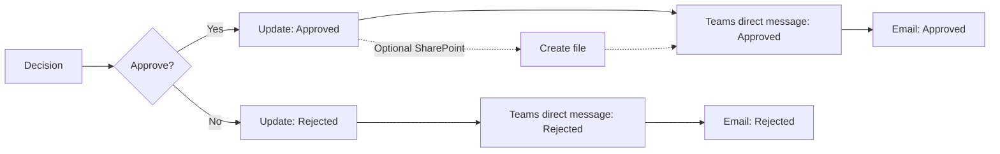

# แบบฝึกหัดที่ 8: แจ้งผลผู้ขอผ่าน Microsoft Teams

เราจะต่อยอด flow จากแบบฝึกหัดที่ 3 ให้ส่งข้อความตรงถึงผู้ขอผ่าน `Microsoft Teams` หลังจากทราบผล Approve หรือ Reject โดยไม่ต้องสร้าง Team หรือ channel สำหรับห้องเรียน กิจกรรมนี้ทำได้ไม่ว่าจะทำหรือข้ามเนื้อหาส่วนของ SharePoint มาหรือไม่

> **License:** ใช้ Microsoft Teams connector ซึ่งเป็น Standard connector ใน Power Automate ไม่ใช้ Premium connector


## Prerequisites

- Flow `Record Task Request - [Your Name]` จาก [แบบฝึกหัดที่ 3](./03-ask-for-a-decision.md) ทำงานครบทั้ง Approved และ Rejected
- ผู้เรียนเข้า Microsoft Teams ด้วยบัญชีเดียวกับที่ใช้สร้าง flow ได้ โดยเปิดรูปโปรไฟล์ใน Teams ตรวจอีเมลและองค์กรก่อนทดสอบ แม้เปิดจาก App launcher ก็อาจยังใช้บัญชีที่เคยเข้าไว้
- ใช้อีเมลของตนเองในช่อง `RequesterEmail` ระหว่างทดสอบ
- Client IT ยืนยันว่า Teams `Workflows` app ใช้งานได้
- เส้นทาง direct chat ต้องทดสอบด้วย participant-equivalent account ก่อนวันอบรม

> **💡 Analogy:** อีเมลเหมือนส่งจดหมายเข้ากล่อง ส่วน direct Teams chat เหมือนนำโน้ตไปวางบนโต๊ะของผู้รับโดยตรง

## Workflow ที่เราจะต่อยอด



---

## Practice 1: เพิ่มข้อความสำหรับ Approved

**Primary target:** ส่งผล Approved ไปยัง direct chat ของผู้ขอด้วย Dynamic content จากคำขอเดิม

1. เปิด flow `Record Task Request - [Your Name]`
2. ในเส้นทาง **True** (หรือ **If yes** ในหน้าจอเดิม) เพิ่ม action หลัง `Update a row`; หากทำแบบฝึกหัดเสริม SharePoint แล้ว ให้วาง Teams action หลัง `Create file`
3. ค้นหา connector `Microsoft Teams`
4. เลือก action `Post message in a chat or channel`
5. หากระบบขอ connection ให้ Sign in ด้วยบัญชี Microsoft 365 สำหรับการฝึก
6. กำหนดค่า:

   - **Post as:** `Flow bot`
   - **Post in:** `Chat with Flow bot`
   - **Recipient:** เลือก **Settings** ข้างช่อง → **Use dynamic content**
   - จากนั้นพิมพ์ `/` → **Insert dynamic content**
   - แล้วเลือก `Requester email` จาก `Get response details` ตรวจว่าแสดงเป็น token แสดงในแบบฟอร์มก่อนทำต่อ
   - **Message:** ใช้ข้อความด้านล่าง

   ```text
   ผลคำขอ: Approved
   RequestId: [Response Id]
   Title: [Task title]
   Next step: งานได้รับการอนุมัติแล้ว โปรดดำเนินการตามขั้นตอนที่ทีมกำหนด
   ```

7. แทน `[Response Id]` ด้วย Dynamic content จาก Forms trigger และ `[Task title]` ด้วย Dynamic content จาก `Get response details` อย่าปล่อยวงเล็บเป็นข้อความคงที่ แล้วเลือก **Save**

### Expected output

- เส้นทาง Approved มี action ที่ส่ง direct Teams message ไปยัง `Requester email`

### Checkpoint

- ค่า `Post as`, `Post in` และ `Recipient` ตรงตามที่กำหนด และข้อความมี `Response Id` กับ `Task title`

---

## Practice 2: เพิ่มข้อความสำหรับ Rejected

**Primary target:** สร้างข้อความอีกหนึ่งแบบเพื่อให้ผู้รับเห็นผลและ next step ที่ถูกต้อง

1. ในเส้นทาง **False** (หรือ **If no** ในหน้าจอเดิม) เพิ่ม `Post message in a chat or channel` หลัง `Update a row`
2. กำหนดค่า `Post as`, `Post in` และ `Recipient` เหมือน Practice 1
3. ใช้ข้อความ:

   ```text
   ผลคำขอ: Rejected
   RequestId: [Response Id]
   Title: [Task title]
   Next step: โปรดตรวจรายละเอียดกับผู้ตัดสินใจก่อนส่งคำขอใหม่
   ```

4. แทน `[Response Id]` และ `[Task title]` ด้วย Dynamic content เช่นเดียวกับ Practice 1 แล้วเลือก **Save**

### Expected output

- แต่ละเส้นทางมีข้อความของตนเอง และส่งถึงผู้ขอคนเดียวกับข้อมูลใน Form

### Checkpoint

- ข้อความ Approved และ Rejected ใช้สถานะกับ next step คนละแบบอย่างชัดเจน

---

## Practice 3: ทดสอบ direct chat ทั้งสองผล

**Primary target:** ยืนยันผลปลายทางใน Teams ไม่ใช่ดูเพียงสถานะ `Succeeded`

1. เปิด Microsoft Teams ด้วยบัญชีผู้ขอ
2. ส่ง Form ใหม่แล้วเลือก `Approve`
3. รอ run จบ แล้วเปิด **Chat** ใน Microsoft Teams มองหาแชต **Workflows** ซึ่งเป็นชื่อผู้ส่งที่พบในการทดสอบ แม้ใน action จะเลือก `Flow bot`
4. ตรวจ `RequestId`, `Title`, ผล และ next step
5. ส่ง Form ใหม่อีกครั้งแล้วเลือก `Reject`
6. ตรวจข้อความ Teams ครั้งที่สอง
7. เปิด Run history แล้วขยาย **Condition** และเส้นทางที่ทำงาน คลิก `Post message in a chat or channel` ตรวจ **Inputs** ว่าผู้รับและข้อความตรงกับคำขอ และ **Outputs** มี `id` กับ `messageLink` เทียบกับข้อความที่ได้รับจริง
8. ตรวจอีเมลแจ้งผลและแถว Excel ของทั้งสองคำขอด้วย หากทำแบบฝึกหัดเสริม SharePoint ให้ตรวจเพิ่มว่า Approved มีไฟล์และ Rejected ไม่มีไฟล์ของคำขอนั้น
9. หลังฝึกครบ เลือก **Turn off** ที่หน้ารายละเอียด flow และเก็บข้อมูลทดสอบไว้ตามที่วิทยากรกำหนด

### Expected output

- ผู้ขอได้รับ direct message หนึ่งข้อความสำหรับ Approved และอีกหนึ่งข้อความสำหรับ Rejected

### Checkpoint

- ข้อความทั้งสองรายการตรงกับ Response Id ของ Form และแสดงผลคนละเส้นทางถูกต้อง

---

## ตรวจลำดับ action ก่อนทดสอบ

- Approved เส้นทางหลัก: `Update a row` → Teams message → อีเมลแจ้งผลเดิม
- Approved เมื่อทำ SharePoint เพิ่ม: `Update a row` → `Create file` → Teams message → อีเมลแจ้งผลเดิม
- Rejected: `Update a row` → Teams message → อีเมลแจ้งผลเดิม

เราเพิ่ม Teams เข้าไปโดยเก็บอีเมลแจ้งผลจากแบบฝึกหัดที่ 3 ไว้ ผู้ขอจึงได้รับทั้งอีเมลและ Teams เมื่อเส้นทางทำงานสำเร็จ หาก action ก่อนหน้าล้มเหลว ให้ตรวจ Run history เพราะ action ถัดไปอาจถูกข้าม

## Optional variation: ส่งเข้าช่องของทีม

ทำส่วนนี้เฉพาะเมื่อ Client IT ยืนยัน Team และ standard channel สำหรับการฝึกแล้ว

1. เพิ่มหรือคัดลอก action `Post message in a chat or channel`
2. ตั้ง **Post as** เป็น `Flow bot`
3. ตั้ง **Post in** เป็น `Channel`
4. เลือก Team และ channel ที่วิทยากรแจ้ง
5. ใช้ข้อความสมมติที่ไม่มีข้อมูลส่วนบุคคลหรือข้อมูลงานจริง
6. ทดสอบหนึ่งครั้งและลบข้อความตามวิธี cleanup ที่ตกลงกับ IT

> **⚠️ Note:** ไม่ใช้ private channel ในกิจกรรมนี้ เพราะ action นี้ไม่รองรับการโพสต์ข้อความไปยัง private channel

## Troubleshooting

| อาการ | ตรวจสอบและแก้ไข |
|---|---|
| ไม่พบ action หรือ action ถูก block | ให้ IT ตรวจว่า Teams `Workflows` app เป็น Allow และ DLP policy อนุญาต connector |
| สร้าง Teams connection ไม่ได้ | ตรวจว่าบัญชีเดียวกันเข้า Teams ได้ แล้ว Sign in ใหม่จาก Connections |
| ส่ง direct chat ไม่ได้ | ตรวจเส้นทางที่ rehearsal ไว้; หาก policy เปลี่ยนให้ใช้ instructor demonstration หรือ saved result |
| Recipient ไม่ถูกต้อง | ใช้ Dynamic content `Requester email` และทดสอบด้วยอีเมลของตนเอง |
| Run สำเร็จแต่หา chat ไม่พบ | เปิด **Chat** แล้วหา **Workflows** (บางหน้าจออาจใช้ชื่อ `Flow bot`) ตรวจบัญชีและองค์กรจากรูปโปรไฟล์ แล้วเทียบเวลาและ RequestId |
| เลือก Team หรือ channel ไม่ได้ | ส่วน channel เป็น optional เท่านั้น; กลับไปใช้ `Chat with Flow bot` |

## Summary

เราได้ส่งผลการตัดสินใจไปยัง direct Teams chat โดยใช้ข้อมูลจาก flow เดิม และไม่ต้องเตรียม Team หรือ channel สำหรับกิจกรรมหลัก

## Microsoft Learn references

- [Microsoft Teams connector — Standard classification and limitations](https://learn.microsoft.com/en-us/connectors/teams/)
- [Send a message in Teams using Power Automate](https://learn.microsoft.com/en-us/power-automate/teams/send-a-message-in-teams)

แบบฝึกหัดถัดไป → [ทำความเข้าใจและรับมือข้อผิดพลาด](./05-understand-and-recover-from-errors.md)

กลับไป → [เส้นทางการฝึก Day 1](../index.md)
