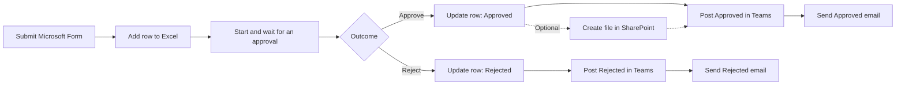

วันนี้พลจะพาพวกเราสร้าง workflow รับคำของานแบบทีละขั้นตอนสำหรับผู้เริ่มต้น แต่ละ connector มีผลลัพธ์ที่เห็นและตรวจสอบได้ทันที ก่อนนำทุกส่วนมาต่อเป็น workflow เดียวตั้งแต่รับคำขอจนแจ้งผล

ทุกคนใช้ไฟล์ Excel ของตัวเองใน `OneDrive for Business` เป็นที่เก็บ workbook ที่เตรียมไว้ โดยไม่ต้องสร้าง flow แยกสำหรับ OneDrive

> **License:** เส้นทางหลักใช้ Standard connectors ได้แก่ `Office 365 Outlook`, `Microsoft Forms`, `Excel Online (Business)` และ `Microsoft Teams` รวมถึง `Standard approvals` กับ Built-in actions ของ Power Automate ส่วน SharePoint เป็น Standard connector ในกิจกรรมเสริม ไม่ใช้ Premium connector บัญชี สิทธิ์ และ policy ของบริการที่เกี่ยวข้องต้องผ่านและได้รับอนุญาตให้ใช้งานจากฝ่าย IT หรือผู้ดูแลระบบก่อน

## สิ่งที่ต้องเตรียม

- เข้าใช้งาน [Power Automate](https://make.powerautomate.com), `Microsoft Forms`, `Outlook`, `OneDrive for Business` และ `Microsoft Teams` ได้
- ดาวน์โหลด [task-request-tracker.xlsx](https://raw.githubusercontent.com/teerasej/cpall-gosoft-power-automate-2026/main/docs/public/downloads/task-request-tracker.xlsx) และอัปโหลดไว้ในโฟลเดอร์ `PowerAutomateTraining` ของ OneDrive
- ใช้อีเมลของตัวเองเป็นผู้ขอและผู้อนุมัติระหว่างการฝึก หรือใช้อีเมลฝึกที่วิทยากรกำหนด
- เปิดไฟล์ Excel เพื่อตรวจว่า table ชื่อ `RequestsTable` แล้วปิดไฟล์ก่อนทดสอบ flow
- ตรวจว่า Teams `Workflows` app ใช้งานได้ และใช้ direct chat ตามเส้นทางที่วิทยากร rehearsal แล้ว
- หากวิทยากรเลือกกิจกรรม SharePoint ให้เปิดเฉพาะ Route A หรือ Route B ที่วิทยากรส่งให้

> **⚠️ Note:** อย่าแก้ไฟล์ Excel ระหว่างที่ flow กำลังเขียนข้อมูล การเปลี่ยนแปลงจาก connector อาจใช้เวลาประมาณ 30 วินาทีจึงจะแสดงผลการทำงานได้ครบถ้วนครับ

## เส้นทางการฝึกหลัก

ทำตามลำดับ **1 → 2 → 3 → 8 → 5** ช่วง 13:30 วิทยากรจะเลือกกิจกรรมทบทวน Approval หรือกิจกรรม SharePoint เพิ่มอีกหนึ่งเส้นทาง ทั้งสองทางกลับมาเริ่มแบบฝึกหัดที่ 8 เหมือนกัน

  <a href="./exercises/01-first-task-notification"><strong>1 · Outlook</strong>ส่งการแจ้งเตือนงานครั้งแรก</a>
  <a href="./exercises/02-collect-and-record-requests"><strong>2 · Forms + Excel</strong>รับและบันทึกคำของาน</a>
  <a href="./exercises/03-ask-for-a-decision"><strong>3 · Approvals</strong>ขออนุมัติและอัปเดตคำขอ</a>
  <a href="./exercises/08-notify-requester-in-teams"><strong>8 · Teams</strong>แจ้งผลกลับไปยังผู้ขอ</a>
  <a href="./exercises/05-understand-and-recover-from-errors"><strong>5 · Run history</strong>เข้าใจและรับมือข้อผิดพลาด</a>

## กิจกรรมที่วิทยากรเลือกเวลา 13:30

เปิดเพียงหนึ่งกิจกรรมตามที่วิทยากรประกาศ:

- [ทบทวนและพิสูจน์เส้นทาง Approve/Reject](./exercises/07-core-approval-reinforcement.md) — ไม่ต้องเปิดหน้า SharePoint
- [เก็บคำขอที่อนุมัติแล้วใน SharePoint](./exercises/07-archive-approved-request-in-sharepoint.md) — Optional และเลือก Route A หรือ Route B เพียงเส้นทางเดียว

## แบบฝึกหัดเสริม / Take-home

- [ส่งสรุปงานค้างประจำวัน](./exercises/04-daily-pending-summary.md) — Scheduled flow สำหรับศึกษาต่อ

## ตารางเวลา

| Time | Activity |
|---|---|
| 09:00–09:30 | Automation basics, Trigger, Action, Connector และ governance ที่แทรกในงาน |
| 09:30–10:15 | Outlook: first Instant cloud flow และตรวจ Inbox |
| 10:15–10:30 | Break |
| 10:30–11:30 | Forms และ Excel: ส่งหนึ่งคำขอและเพิ่มหนึ่งแถวใน `RequestsTable` |
| 11:30–12:00 | Approvals: เพิ่ม `Start and wait for an approval` |
| 12:00–13:00 | Lunch |
| 13:00–13:30 | สร้าง Approve/Reject Condition และอัปเดตแถวเดิม |
| 13:30–14:00 | Instructor-selected: ทบทวน Approval หรือทำ SharePoint extension |
| 14:00–14:30 | Teams: ส่งผลไปยัง direct chat |
| 14:30–14:45 | Break |
| 14:45–15:15 | ทดสอบ workflow ครบทั้ง Approved และ Rejected |
| 15:15–15:35 | Live error recovery ด้วย Run history และ Run After |
| 15:35–15:50 | Instructor demonstration และ discussion: AI Builder |
| 15:50–16:00 | Review และ Q&A |

รวม 330 นาทีสำหรับ instruction/activity, พัก 30 นาที และ lunch 60 นาที

## ไฟล์ประกอบ

- [สไลด์ผู้เรียน Power Automate Day 1](/downloads/CPAll-Power-Automate-Day-1.pptx)
- [ตัวอย่างคำของาน](./resources/sample-requests.md)
- [Excel tracker](https://raw.githubusercontent.com/teerasej/cpall-gosoft-power-automate-2026/main/docs/public/downloads/task-request-tracker.xlsx)

## ภาพรวม Workflow

เมื่อจบวันนี้ ผู้เรียนจะมี workflow รุ่นแรกที่ทดสอบครบสองผลลัพธ์ รู้ว่าผลใดเกิดใน Excel และ Teams และใช้ Run history ตรวจสอบเมื่อ flow ไม่เป็นไปตามคาดได้ ผู้ที่เลือก SharePoint จะมีไฟล์ Approved เป็นหลักฐานเพิ่มอีกหนึ่งจุด

## ขอบเขต License และกิจกรรมเสริม

เส้นทางหลักใช้ Standard connectors และ Built-in actions แต่ยังต้องมีสิทธิ์บริการ Microsoft 365 ที่เกี่ยวข้องและผ่าน policy ขององค์กร คำว่า Standard ไม่ได้หมายความว่าทุกบริการใช้งานได้ฟรีโดยไม่ต้องมี license

SharePoint เป็น **Optional / Instructor-selected** ไม่เป็นเงื่อนไขการผ่าน Day 1 ผู้เรียนเปิดเพียง Route A หรือ Route B ที่ตรงกับสถานการณ์ ส่วนแบบฝึกหัด 4 และ 6 เป็น **Optional / Take-home** และ AI Builder เป็น **instructor-only premium demonstration** แยกจาก flow ของผู้เรียน; ผู้เรียนไม่ต้องเพิ่ม AI Builder action หรือเปิด trial ตามวิทยากร หากสิทธิ์วิทยากรไม่พร้อมให้ใช้ saved result

## Microsoft Learn references

- [Microsoft Forms connector](https://learn.microsoft.com/en-us/connectors/microsoftforms/)
- [Office 365 Outlook connector](https://learn.microsoft.com/en-us/connectors/office365/)
- [Excel Online (Business) connector and limitations](https://learn.microsoft.com/en-us/connectors/excelonlinebusiness/)
- [OneDrive for Business connector](https://learn.microsoft.com/en-us/connectors/onedriveforbusiness/)
- [Standard approvals connector](https://learn.microsoft.com/en-us/connectors/approvals/)
- [SharePoint connector](https://learn.microsoft.com/en-us/connectors/sharepointonline/)
- [Microsoft Teams connector](https://learn.microsoft.com/en-us/connectors/teams/)
- [Send a message in Teams using Power Automate](https://learn.microsoft.com/en-us/power-automate/teams/send-a-message-in-teams)

[แก้ไขหน้านี้บน GitHub](https://github.com/teerasej/cpall-gosoft-power-automate-2026/edit/main/docs/index.md)
