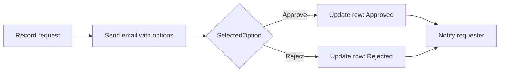

# แบบฝึกหัดที่ 3: ขอผลตัดสินใจทางอีเมล

เราจะต่อยอด flow เดิมให้ส่งอีเมลพร้อมตัวเลือก `Approve` และ `Reject` แล้วอัปเดตแถวเดิมใน Excel ตามคำตอบ

> **License:** ใช้ `Office 365 Outlook` และ `Excel Online (Business)` ซึ่งเป็น Standard connectors แบบฝึกหัดหลักไม่ได้ใช้ dedicated Approvals service

## Prerequisites

- Flow `Record Task Request - [Your Name]` จากแบบฝึกหัดที่ 2 ทำงานสำเร็จ
- กำหนดอีเมลผู้ตัดสินใจสำหรับการฝึก โดยใช้อีเมลของตัวเองหรือบัญชีที่วิทยากรจัดให้

## Workflow ที่เราจะสร้าง



---

## Practice 1: ส่งอีเมลที่มีตัวเลือก

**Primary target:** รอรับคำตอบจาก `Send email with options` เพื่อให้ flow มีค่า `SelectedOption` สำหรับตัดสินใจ

1. เปิด flow `Record Task Request - [Your Name]`
2. หลังอีเมลยืนยัน เพิ่ม action `Send email with options` จาก Office 365 Outlook
3. กำหนดค่า:

   - **To:** อีเมลผู้ตัดสินใจสำหรับการฝึก
   - **Subject:** `Decision needed: ` + `Task title`
   - **User Options:** `Approve,Reject`
   - **Body:** แสดง `Description`, `Category`, `Needed by`, `Requester email` และ `Response Id`

4. เลือก **Save**
5. ส่ง Form ใหม่ 1 ครั้ง แล้วเปิดอีเมลที่ส่งถึงผู้ตัดสินใจ

### Checkpoint

- อีเมลแสดงตัวเลือก `Approve` และ `Reject` และ flow รอคำตอบอยู่ที่ action นี้

> **⚠️ Note:** `Send email with options` เป็นการตัดสินใจทางอีเมลแบบเบา เหมาะกับการฝึกพื้นฐาน ไม่ใช่ประวัติการอนุมัติแบบเต็มของ dedicated Approvals service

---

## Practice 2: แยกเส้นทางด้วย Condition

**Primary target:** ตรวจค่า `SelectedOption` เพื่อให้ flow เลือกเส้นทาง Approved หรือ Rejected ได้ถูกต้อง

1. หลัง `Send email with options` เพิ่ม Built-in action `Condition`
2. กำหนดเงื่อนไข:

   ```text
   SelectedOption is equal to Approve
   ```

3. ในแขนง **If yes** เพิ่ม `Update a row` ของ Excel Online (Business)
4. เลือก workbook และ `RequestsTable` เดิม
5. กำหนด **Key Column** เป็น `RequestId` และ **Key Value** เป็น Dynamic content `Response Id`
6. ใส่ `Status` เป็น `Approved` และ `Decision` เป็น `Approve`
7. ในแขนง **If no** เพิ่ม `Update a row` แบบเดียวกัน แล้วใส่ `Status` เป็น `Rejected` และ `Decision` เป็น `Reject`
8. เลือก **Save**

### Checkpoint

- Condition มี 2 เส้นทาง และทั้งสองเส้นทางค้นหาแถวด้วย `RequestId` ค่าเดียวกับ Forms response ID

> **💡 Tip:** Condition เหมือนพนักงานที่เคาน์เตอร์ อ่านคำตอบแล้วส่งเอกสารไปช่องที่ถูกต้อง

---

## Practice 3: แจ้งผลและทดสอบทั้งสองเส้นทาง

**Primary target:** ยืนยันผลปลายทางทั้ง Approved และ Rejected เพื่อพิสูจน์ว่า flow อัปเดตแถวถูกต้อง

1. ต่อจาก `Update a row` ในแต่ละแขนง เพิ่ม `Send an email (V2)`
2. ส่งหา `Requester email` และใช้หัวข้อ `Decision for: ` + `Task title`
3. ใน **If yes** ระบุ `Decision: Approved`
4. ใน **If no** ระบุ `Decision: Rejected`
5. เลือก **Save**
6. ส่ง Form ครั้งที่ 1 แล้วเลือก `Approve`
7. รอ run สำเร็จและตรวจ Excel กับอีเมล
8. ส่ง Form ครั้งที่ 2 แล้วเลือก `Reject`
9. รอ run สำเร็จและตรวจ Excel กับอีเมล

### Checkpoint

- มีรายการทดสอบหนึ่งรายการเป็น `Approved` และอีกหนึ่งรายการเป็น `Rejected` โดยอัปเดตคนละ RequestId

> **⚠️ Note:** ถ้า action card ไม่แสดงใน Outlook client ให้เปิดอีเมลด้วย Outlook on the web หรือตอบผ่านหน้าที่ connector แสดงตามนโยบายของ tenant

---

## Summary

เราได้สร้าง workflow ที่รอคำตอบ แยกเส้นทาง อัปเดตแถวเดิม และแจ้งผลผู้ขอครบทั้งสองกรณี

เมื่อต้องการต่อยอดและ Client IT ยืนยัน readiness แล้ว:

- [Optional Exercise 7: เก็บคำขอที่อนุมัติแล้วใน SharePoint](../07-archive-approved-request-in-sharepoint/README.md)
- [Optional Exercise 8: แจ้งผลผู้ขอผ่าน Microsoft Teams](../08-notify-requester-in-teams/README.md)

ขั้นตอนถัดไป → [ส่งสรุปงานค้างประจำวัน](../04-daily-pending-summary/README.md)
