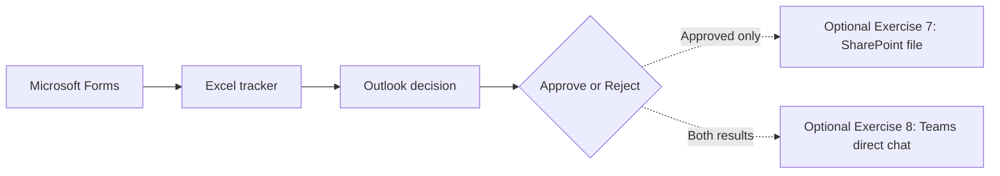

# Presentation slide outline — Power Automate Day 1

**Session:** 09:00–16:30

**Audience:** Beginner business users

**Theme:** เปลี่ยนคำของานให้เป็น workflow ที่ติดตามได้

**Core connectors:** Microsoft Forms, Office 365 Outlook, Excel Online (Business)

**Optional Standard connectors:** SharePoint, Microsoft Teams

**Delivery language:** Thai-first; retain official English product and UI terms

**Client alignment meeting:** 14 September 2026

**PPTX status:** Keep this outline in Markdown. Generate a PPTX only after the owner requests it.

## Client discussion slides for 14 September 2026

Slides `C1–C9` support the client readiness and curriculum discussion. They are not part of the 36-slide learner session. After the client confirms the environment and learning scope, retain the final decisions in the instructor notes and remove unresolved questions from the learner-facing deck.

### Slide C1: Environment decision for hands-on delivery

- **Key message:** The core exercises can run with individual OneDrive workbooks and Outlook. Two optional extensions can add SharePoint and Teams with limited IT preparation.
- **Suggested visual:** Two delivery routes, like a planned road and a prepared detour
  - Confirmed environment: add one shared SharePoint library and direct Teams chat extensions
  - Safe baseline: use Forms, Excel Online (Business) in OneDrive and Outlook
- **Questions for the client:**
  - Can every participant edit files in one existing SharePoint `Documents` library?
  - Is the Teams `Workflows` app allowed, and can a participant receive a direct Flow bot message?
  - Do tenant DLP policies allow the required connectors to work together?
  - Which advanced topics must every participant build, and which topics can remain instructor demonstrations?
- **Decision to record:** Select `Confirmed environment`, `Hybrid delivery` or `Safe baseline` for the delivered session.

### Slide C2: SharePoint readiness

- **Key message:** The lowest-preparation SharePoint path uses one existing site and its default `Documents` library. No custom list or site per learner is required.
- **Client IT confirmations:**
  - One existing training site and its default `Documents` library are identified before rehearsal
  - Participant accounts can open the library and create and delete files
  - The instructor has sufficient access to demonstrate and troubleshoot the flow
  - Learners can create folders named `PA-[learner number]-[name]` to prevent filename conflicts
  - DLP and information-governance policies permit the training scenario
- **Evidence requested:** Test one participant account by creating and opening an Approved request file, then verify that a Rejected request creates no file.
- **Decision to record:** `Ready for hands-on`, `Instructor demonstration only` or `Use Excel fallback`.

### Slide C3: Microsoft Teams readiness

- **Key message:** The lowest-preparation Teams path sends a direct `Chat with Flow bot`; it does not require a Team or channel.
- **Client IT confirmations:**
  - Participant accounts can sign in to Teams and create the Microsoft Teams connection
  - Teams `Workflows` app is set to Allow in Teams admin center
  - A participant can receive a direct message using `Post as: Flow bot` and `Post in: Chat with Flow bot`
  - DLP and app policies allow the connector to work with the core connectors
  - If channel posting is desired, IT identifies one standard channel and its cleanup method; private channels are excluded
- **Evidence requested:** Send one harmless direct Flow bot message to a participant account and confirm the RequestId and decision are visible.
- **Decision to record:** `Ready for hands-on`, `Instructor demonstration only` or `Omit from learner build`.

### Slide C4: Decision record and next actions

- **Key message:** The final exercise path follows verified access rather than an assumed tenant configuration.
- **Suggested visual:** Decision table with owner, evidence and completion date

| Area | Status before meeting | Evidence needed | Owner and completion date |
|---|---|---|---|
| SharePoint site and `Documents` library | Pending client confirmation | Participant creates, opens and deletes one test file | Confirm on 14 September |
| Teams direct Flow bot message | Pending client confirmation | Workflows app allowed; participant receives one direct test message | Confirm on 14 September |
| Optional Teams channel variation | Not required for low-setup path | Existing standard channel and cleanup method, if requested | Confirm on 14 September |
| Forms, OneDrive, Excel and Outlook baseline | Requires rehearsal | Complete Exercises 1–3 with a participant account | Confirm on 14 September |
| Demo scenario delivery level | Pending client direction | Label each scenario as build, demonstration, extension or fallback | Confirm on 14 September |
| Exercises 4–5 learner scope | Requires adjustment or more time | Beginner rehearsal within the allocated 25 and 15 minutes | Confirm on 14 September |
| Final delivery path | Pending | Record selected path and fallback | Confirm on 14 September |

- **Meeting output:** Record the chosen path, named IT owner, rehearsal date and any participant preparation steps.
- **Content impact:** Keep the existing Excel and Outlook exercises as the guaranteed path. Add SharePoint or Teams to the learner build only after the relevant readiness test passes.

### Slide C5: Demo scenarios and learner activities

- **Key message:** The five business scenarios now map to the core story or an optional extension. The client should confirm which activities are live builds and which remain demonstrations.
- **Suggested visual:** One common automation pattern connected to five business scenarios

| Demo Business Scenario | Current learner connection | Proposed delivery direction | Client decision needed |
|---|---|---|---|
| Email Approval Process | Exercise 3 uses Outlook options, Condition and status updates | Build as the core decision workflow | Confirm that a lightweight email decision meets the expected outcome |
| Leave Request Process | Exercises 2–3 use the same request, tracking and decision pattern | Explain as a business variation of the task-request flow | Confirm whether the learner story should use leave requests explicitly |
| Document Approval | Exercise 3 provides the decision; no document action exists in the core | Optional Exercise 7 archives an Approved request summary as a SharePoint file | Confirm `Optional hands-on`, `Instructor demonstration` or `Omit` |
| Teams Notifications | Outlook remains the core notification path | Optional Exercise 8 sends a direct Flow bot chat without a Team or channel | Confirm direct-chat rehearsal; decide whether channel variation is needed |
| SharePoint Automation | Exercises 2–4 retain Excel in OneDrive as the core tracking store | Optional Exercise 7 uses one existing `Documents` library and learner folders; no custom list | Confirm library access or retain Excel-only delivery |

- **Questions for the client and IT team:**
  - Are all five scenarios illustrative demonstrations, or are any of them required learner outcomes?
  - Which scenarios must every participant build during the afternoon workshop?
  - Should Exercises 7–8 use additional time, replace selected demonstrations, or remain take-home extensions?
- **Decision to record:** Approve one delivery label for every scenario: `Build`, `Instructor demonstration`, `Optional extension` or `Fallback example`.
- **Content impact:** Update slides 15–20 and the learner exercises after the client confirms the scenario mapping and environment readiness.

### Slide C6: Alignment with the proposed agenda

- **Key message:** The current design covers most agenda topics, with strong alignment in the foundations and deliberate adaptations in the afternoon workshop.
- **Working assessment:** Approximately 85–90% topic alignment. The beginner direction aligns strongly, while the current capstone only partially matches the original tool combination.

| Agenda area | Alignment | Current treatment |
|---|---|---|
| Power Automate fundamentals | Strong | Triggers, actions, connectors, Dynamic content, variables and expressions |
| Cloud flow types | Strong | Learners build Instant, Automated and Scheduled cloud flows |
| Testing and debugging | Strong | Checkpoints, Run history, controlled failure, Scope and Run After |
| Standard connectors | Strong | Forms, Outlook and Excel Online (Business) form the core; SharePoint and Teams are optional Standard-connector builds |
| Flow administration | Light | Sharing, permissions, templates, monitoring and Code view appear mainly in teaching slides |

- **Discussion point:** Confirm whether administration topics need a learner task or can remain guided explanation and demonstration.

### Slide C7: Adaptations in the workshop and capstone

- **Key message:** The current learner journey preserves the automation concepts but reduces environment dependencies and advanced approval complexity.

| Agenda area | Alignment | Difference from the proposed agenda | Direction to confirm |
|---|---|---|---|
| Advanced controls | Mostly aligned | Condition and Apply to each are hands-on. Do Until is demonstrated. | Confirm whether Do Until must be built |
| Approval workflows | Partial | Core uses Outlook email options. Dedicated Approvals, multi-stage and custom responses are demonstrations. | Confirm the required approval depth |
| Business demonstrations | Mostly aligned with optional path | Email and request scenarios connect to core exercises. Document, SharePoint and Teams gain optional hands-on extensions. | Confirm the delivery label for each scenario |
| Capstone | Adapted with optional outputs | Core remains Forms, Excel and Outlook; Approved requests can create a SharePoint file and both decisions can send Teams chat | Confirm the environment-based capstone path |

- **Discussion point:** SharePoint and Teams can be added with low setup, while dedicated Approvals remains a separate demonstration. Optional Exercises 7–8 still require participant-account rehearsal and 25–35 minutes if taught live.

### Slide C8: Optional continuation path when the environment is ready

- **Key message:** Learners complete the Forms → Excel → Outlook core first, then continue from Exercise 3 to SharePoint or Teams without rebuilding the workflow.
- **Suggested visual:** Use solid arrows for the required path and dotted arrows for optional outputs.

| Path | Minimum IT preparation | Learner time | Fallback |
|---|---|---:|---|
| SharePoint archive | One existing site, `Documents` library and Edit permission | 15–20 min | Instructor demonstration |
| Teams direct chat | Teams access and `Workflows` app allowed | 10–15 min | Saved result or Outlook notification |
| Teams channel variation | Existing standard Team and channel | About 5 min extra | Use direct chat |

- **Low-setup boundary:** No learner-created environment, custom SharePoint list, dedicated Team or Premium connector is required.
- **Readiness label:** SharePoint and Teams paths are `ต้องตรวจสอบก่อนเริ่มอบรม` using a participant-equivalent account.
- **Instructor cue:** Present the core as the guaranteed route. Reveal the dotted extensions only after the client confirms access, policy and available time.
- **Exercise links:** [Optional Exercise 7 — SharePoint archive](./exercises/07-archive-approved-request-in-sharepoint/README.md) · [Optional Exercise 8 — Teams notification](./exercises/08-notify-requester-in-teams/README.md)
- **Decision to record:** Label each optional path as `Optional hands-on`, `Instructor demonstration`, `Take-home extension` or `Omit`.

### Slide C9: Exercise pacing and simplification choices

- **Key message:** Exercises 4 and 5 contain too many learner actions for their current time slots. The meeting should confirm simpler core goals or approve a time reallocation.

| Exercise | Current load and time | Delivery assessment | Proposed beginner core goal |
|---|---|---|---|
| Exercise 1 | 13 steps in 30 minutes | Realistic | Keep current goal |
| Exercise 2 | 21 steps in 60 minutes | Achievable when accounts and files are ready | Keep current goal with readiness check |
| Exercise 3 | 22 steps in about 55 minutes | Achievable with allowance for Outlook response delay | Keep both decision branches; use a saved result fallback |
| Exercise 4 | 27 steps in 25 minutes | Too dense | Build Recurrence, find Pending rows and send one simple summary. Move variables, Apply to each and three-case testing to demonstration or extension. |
| Exercise 5 | 19 steps in 15 minutes | Too dense | Inspect one prepared failed run, configure one Run After notification and verify one successful rerun |
| Exercise 6 | 16 steps in 15 minutes | Suitable as paired planning | Keep as a short Canvas discussion rather than a software build |

- **Recommended direction:** Adopt the simplified goals for Exercises 4 and 5. Keep the advanced steps in the learner material as optional extensions.
- **Alternative:** Keep the detailed builds and reallocate at least 20–30 minutes from optional demonstrations or Exercise 6.
- **Environment note for Exercise 3:** Use an individual mailbox for `Send email with options`. Outlook actionable messages do not support group or shared mailboxes. Validate the experience with a participant account and keep a saved result fallback. [Microsoft Learn reference](https://learn.microsoft.com/en-us/connectors/office365/#known-issues-and-limitations-with-actions)
- **Decision to record:** Approve the core goal for Exercises 4 and 5 and identify which advanced steps remain demonstrations.
- **Optional-exercise guardrail:** Do not add Exercises 7–8 on top of the fixed agenda unless 25–35 minutes is added or selected business demonstrations are shortened. They may remain take-home extensions.

## Timing map

| Time | Segment | Slides / activity |
|---|---|---|
| 09:00–09:20 | Opening and outcomes | Slides 1–4 |
| 09:20–10:15 | Foundations and first demonstration | Slides 5–11 |
| 10:15–10:30 | Break | — |
| 10:30–11:00 | Guided Exercise 1 | Slides 12–14 + Exercise 1 |
| 11:00–12:00 | Business scenarios and design choices | Slides 15–19 |
| 12:00–13:00 | Lunch | — |
| 13:00–13:15 | Workshop setup | Slides 20–21 |
| 13:15–14:15 | Guided Exercise 2 | Slides 22–24 + Exercise 2 |
| 14:15–14:30 | Decision workflow introduction | Slides 25–26 + start Exercise 3 |
| 14:30–14:45 | Break | — |
| 14:45–15:25 | Complete decision workflow | Slides 27–28 + Exercise 3 |
| 15:25–15:50 | Scheduled summary | Slides 29–30 + Exercise 4 |
| 15:50–16:05 | Error handling | Slides 31–32 + Exercise 5 |
| 16:05–16:20 | Workplace transfer | Slides 33–35 + Exercise 6 |
| 16:20–16:30 | Review and Q&A | Slide 36 |

> **Client review note:** The 25-minute Exercise 4 slot and 15-minute Exercise 5 slot assume the simplified goals proposed in Slide C9. The current detailed learner instructions require more time.

> **Optional extension note:** Exercises 7–8 are outside the fixed core timing. Deliver them live only after tenant rehearsal and an explicit time decision; otherwise use them as take-home activities or instructor demonstrations.

## Slides 1–4: Opening and outcomes

### Slide 1 — Power Automate Day 1

- **Key message:** วันนี้เราจะเปลี่ยนคำของานหนึ่งรายการให้เดินทางผ่านระบบได้เอง
- **Suggested visual:** Forms → Excel logbook → Outlook decision → daily summary
- **Instructor cue:** เปิดด้วยตัวอย่าง “ถ้าคำของานเข้ามา 20 รายการ เราจะรู้ได้อย่างไรว่ารายการใดยังไม่มีคนตอบ?”
- **Exercise link:** [Day 1 learner journey](./README.md)

### Slide 2 — What you will build

- **Key message:** ผู้เรียนจะสร้าง flow ที่ทำงานได้จริง 5 แบบ และออกแบบงานของตนเอง 1 เรื่อง
- **Suggested visual:** หก core milestones ตาม Exercise 1–6 และทางแยก optional ไป SharePoint กับ Teams
- **Instructor cue:** ชี้ผลลัพธ์ที่มองเห็นได้ของแต่ละ Exercise และย้ำว่า Exercise 7–8 ขึ้นกับ readiness กับเวลาที่ client ยืนยัน
- **Exercise link:** [Exercise list](./README.md#เส้นทางการฝึก)

### Slide 3 — One story for the whole day

- **Key message:** Task request เดิมจะถูกต่อยอดทีละส่วนจนเป็น workflow
- **Suggested visual:** Request card เปลี่ยนสถานะ Pending → Approved/Rejected
- **Instructor cue:** ย้ำว่าใช้ข้อมูลสมมติและ workbook ของแต่ละคน

### Slide 4 — Success at 16:30

- **Key message:** สร้าง ทดสอบ อ่านผล และอธิบายได้ว่า flow ควรหยุดหรือไปต่อเมื่อใด
- **Suggested visual:** Checklist 4 ข้อ: Build, Test, Diagnose, Adapt
- **Instructor cue:** ให้ผู้เรียนเลือกหนึ่งข้อที่อยากทำได้มากที่สุด

## Slides 5–11: Foundations

### Slide 5 — Automation starts with a repeatable rule

- **Key message:** งานที่เหมาะมีจุดเริ่ม ข้อมูล และผลลัพธ์ที่ชัด
- **Suggested visual:** เปรียบเทียบงานเป็นขั้นตอนกับงานที่ต้องใช้วิจารณญาณสูง
- **Instructor cue:** ใช้อุปมา “สูตรอาหารช่วยงานที่ทำซ้ำ แต่คนยังเลือกเมนูและชิมผลลัพธ์”

### Slide 6 — Trigger, action and connector

- **Key message:** Trigger เริ่ม flow, action ทำงาน, connector เชื่อมบริการ
- **Suggested visual:** Doorbell → checklist → delivery service
- **Instructor cue:** Trigger คือกริ่งหน้าบ้าน ไม่ใช่คนส่งพัสดุ

### Slide 7 — Three cloud flow types

- **Key message:** Instant เริ่มโดยคน, Automated เริ่มจากเหตุการณ์, Scheduled เริ่มตามเวลา
- **Suggested visual:** ปุ่มกด, แบบฟอร์มเข้า, นาฬิกา
- **Instructor cue:** ให้ผู้เรียนจับคู่ตัวอย่างงานกับ flow type

### Slide 8 — Standard connectors for today

- **Key message:** Core lab ใช้ Forms, Outlook และ Excel Online (Business) เท่านั้น
- **Suggested visual:** Core connector cards และ optional SharePoint/Teams cards พร้อมป้าย Standard
- **Instructor cue:** Built-in actions เช่น Condition และ Filter array ไม่ใช่ Premium connectors; connector เป็น Standard ยังต้องตรวจ entitlement, policy และ permission

### Slide 9 — License and access are different checks

- **Key message:** มี license ไม่ได้แปลว่า tenant policy, mailbox หรือ OneDrive พร้อมเสมอ
- **Suggested visual:** บัตรผ่านสามด่าน: entitlement, connection, permission
- **Instructor cue:** ทบทวน readiness checklist และใช้ delivery path ที่ client ยืนยันจากการประชุมวันที่ 14 September 2026
- **Exercise link:** [Instructor readiness](./instructor-readiness-checklist.md)

### Slide 10 — Read a flow from left to right

- **Key message:** อ่าน Trigger ก่อน แล้วดู input/output ของแต่ละ action
- **Suggested visual:** Manually trigger → Send an email (V2)
- **Instructor cue:** สาธิต hover หรือเปิด action เพื่อชี้ input และ output

### Slide 11 — Dynamic content carries the data

- **Key message:** Output ของขั้นก่อนหน้าเป็น input ของขั้นถัดไป
- **Suggested visual:** ป้ายชื่อ TaskTitle เดินทางจาก trigger ไป Subject
- **Instructor cue:** เปรียบกับช่องว่างในจดหมายเวียน

## Slides 12–14: First guided build

### Slide 12 — Templates and blank flows

- **Key message:** Template ช่วยเริ่มเร็ว แต่ blank flow ช่วยเห็นโครงสร้างพื้นฐานชัด
- **Suggested visual:** Template card เทียบ blank canvas
- **Instructor cue:** สาธิตการค้น template เท่านั้น แล้วกลับมาสร้าง blank flow สำหรับ Exercise 1

### Slide 13 — Build: My First Task Notification

- **Key message:** รับ TaskTitle และ RecipientEmail แล้วส่งอีเมล
- **Suggested visual:** Trigger inputs → Send an email (V2)
- **Instructor cue:** หยุดหลังสร้าง trigger เพื่อตรวจ checkpoint พร้อมกัน
- **Exercise link:** [Exercise 1](./exercises/01-first-task-notification/README.md)

### Slide 14 — Test and read Run history

- **Key message:** `Succeeded` ต้องมีผลปลายทางถูกต้อง ไม่ใช่ดูเครื่องหมายสีเขียวอย่างเดียว
- **Suggested visual:** Run status + matching Inbox message
- **Instructor cue:** ให้ผู้เรียนเทียบค่าที่กรอกกับ Subject ที่ได้รับ

## Slides 15–19: Business scenarios

### Slide 15 — The same pattern supports many tasks

- **Key message:** เปลี่ยน trigger, data หรือ action แล้วใช้ pattern เดิมกับงานอื่นได้
- **Suggested visual:** หนึ่ง workflow backbone แตกเป็นห้าสถานการณ์
- **Instructor cue:** สาธิตแบบเร็วและถามว่าอะไรเหมือนกันในทุกตัวอย่าง

### Slide 16 — Email and leave-request scenarios

- **Key message:** Email trigger เหมาะกับข้อความที่มีรูปแบบ ส่วน Form เหมาะกับข้อมูลที่ต้องครบ
- **Suggested visual:** Inbox เทียบ structured form
- **Instructor cue:** ชวนตัดสินว่า leave request ควรเริ่มจากช่องทางใด

### Slide 17 — Document and Teams notification scenarios

- **Key message:** เอกสารและ Teams เพิ่มปลายทางใหม่โดยใช้ pattern เดิม แต่ต้องตรวจสิทธิ์ก่อน
- **Suggested visual:** Approved decision → SharePoint file; Approved/Rejected → Teams direct chat
- **Instructor cue:** แนะนำ Optional Exercise 7–8 เมื่อ readiness ผ่าน; direct chat ไม่ต้องมี Team หรือ channel และ SharePoint ใช้ default library เดิม
- **Exercise links:** [Optional Exercise 7](./exercises/07-archive-approved-request-in-sharepoint/README.md) · [Optional Exercise 8](./exercises/08-notify-requester-in-teams/README.md)

### Slide 18 — Replace SharePoint setup with Excel tracking

- **Key message:** Excel table ยังเป็นสมุดบันทึกหลัก ส่วน SharePoint library เป็นตู้เก็บไฟล์เสริมสำหรับรายการ Approved
- **Suggested visual:** Personal Excel logbook plus one shared SharePoint filing cabinet
- **Instructor cue:** ใช้ Excel เป็น guaranteed path; Optional Exercise 7 ต้องการเพียง library กลางหนึ่งแห่งและโฟลเดอร์ผู้เรียน ไม่ต้องสร้าง custom list

### Slide 19 — Map the end-to-end request journey

- **Key message:** Forms รับข้อมูล, Excel เก็บสถานะ, Outlook ส่งผลตัดสินใจ และ optional outputs ส่งต่อไป SharePoint กับ Teams
- **Suggested visual:** Core path เป็นเส้นทึบและ optional outputs เป็นเส้นประ
- **Instructor cue:** ให้ผู้เรียนบอก owner ของแต่ละจุด

## Slides 20–24: Workshop setup and request capture

### Slide 20 — Lightweight email decision vs Approvals

- **Key message:** `Send email with options` เหมาะกับ decision ง่าย ส่วน Approvals มีรูปแบบและประวัติการอนุมัติเฉพาะทาง
- **Suggested visual:** Two-column comparison
- **Instructor cue:** Core lab ใช้ email options; สาธิต Approvals แยกต่างหาก

### Slide 21 — Dedicated Approvals demonstration

- **Key message:** `Start and wait for an approval` รอผลและให้ output สำหรับ Condition; sequential approval และ custom responses เป็นรูปแบบต่อยอด
- **Suggested visual:** Approval request → Outcome พร้อมแขนงผู้อนุมัติลำดับถัดไป
- **Instructor cue:** ใช้บัญชีที่ rehearsal แล้ว สาธิต custom response และภาพรวม multi-stage; แสดง saved result หาก tenant ยังไม่ provision service

### Slide 22 — Prepare the personal tracker

- **Key message:** แต่ละคนใช้ workbook ของตนเองและ table ชื่อ `RequestsTable`
- **Suggested visual:** OneDrive folder and eight-column table
- **Instructor cue:** ตรวจชื่อไฟล์ worksheet และ table ก่อนเปิด Power Automate
- **Exercise link:** [Excel tracker](./files/task-request-tracker.xlsx)

### Slide 23 — Forms response becomes one Excel row

- **Key message:** Forms response ID เป็น key ที่ใช้ติดตามแถวเดิมตลอด workflow
- **Suggested visual:** Field mapping table
- **Instructor cue:** อธิบาย ID เหมือนเลขรับเรื่องที่ไม่ควรซ้ำ
- **Exercise link:** [Exercise 2](./exercises/02-collect-and-record-requests/README.md)

### Slide 24 — Test sequentially

- **Key message:** ปิด workbook รอ run จบ แล้วค่อยตรวจผล
- **Suggested visual:** Submit → wait for Succeeded → inspect Excel → inspect email
- **Instructor cue:** เตือนเรื่อง update delay และห้ามทั้งห้องใช้ workbook เดียวกัน

## Slides 25–28: Decision workflow

### Slide 25 — A Condition chooses the next path

- **Key message:** Condition อ่าน SelectedOption แล้วส่งงานไป If yes หรือ If no
- **Suggested visual:** Service counter split to Approved and Rejected
- **Instructor cue:** ให้ผู้เรียนพูดเงื่อนไขเป็นภาษาคนก่อนสร้างใน designer

### Slide 26 — Control patterns beyond today’s core

- **Key message:** `Apply to each` ทำกับหลายรายการ; `Do Until` ทำซ้ำจนเงื่อนไขครบ
- **Suggested visual:** Checklist loop เทียบ waiting loop
- **Instructor cue:** สาธิต Do Until แบบย่อหรือ diagram ไม่ให้ผู้เรียน build ใน core

### Slide 27 — Update the exact request

- **Key message:** `RequestId` เป็น Key Column เพื่อป้องกันการอัปเดตผิดแถว
- **Suggested visual:** Response ID matching one Excel row
- **Instructor cue:** ชี้ว่าชื่อ key column มีตัวพิมพ์เล็กใหญ่ที่ต้องตรง
- **Exercise link:** [Exercise 3](./exercises/03-ask-for-a-decision/README.md)

### Slide 28 — Verify both branches

- **Key message:** Test only Approve ยังพิสูจน์ไม่ได้ว่า Reject ทำงาน
- **Suggested visual:** Two test cards with expected status and email
- **Instructor cue:** ให้ผู้เรียนจับคู่ตรวจผลของกันและกันโดยไม่ส่งข้อมูลจริง

## Slides 29–32: Summary, monitoring and recovery

### Slide 29 — Scheduled flows check the queue

- **Key message:** Recurrence เปิดรายการตามเวลา แล้ว Filter array คัดเฉพาะ Pending
- **Suggested visual:** Clock → list → filter funnel
- **Instructor cue:** ใช้อุปมา “เปิดสมุดทุกเช้า แล้ววงเฉพาะงานที่ยังไม่จบ”
- **Exercise link:** [Exercise 4](./exercises/04-daily-pending-summary/README.md)

### Slide 30 — Variables and Apply to each build one message

- **Key message:** Variable เก็บข้อความรวม และ Apply to each เติมทีละรายการ
- **Suggested visual:** Empty summary box filling one line at a time
- **Instructor cue:** ใช้ Variables, Apply to each และการทดสอบ 0, 1 และหลายรายการเป็น optional extension หากเวลาหรือระดับผู้เรียนไม่พร้อม

### Slide 31 — Run history is the flight recorder

- **Key message:** ดู action ที่ล้มเหลวและ input/output ก่อนแก้ flow
- **Suggested visual:** Flight recorder analogy + failed Compose
- **Instructor cue:** ใช้ prepared failed run เป็นจุดเริ่ม ให้ผู้เรียนอ่าน error message ก่อนและไม่เริ่มด้วยการลบ action
- **Exercise link:** [Exercise 5](./exercises/05-understand-and-recover-from-errors/README.md)

### Slide 32 — Scope and Run After create a recovery path

- **Key message:** Try รวมงานหลัก ส่วน Catch ทำงานเมื่อ Try failed หรือ timed out
- **Suggested visual:** Try → failure → Catch notification
- **Instructor cue:** ให้ผู้เรียนตั้ง Run After สำหรับ notification หนึ่งจุดและยืนยัน successful rerun ส่วนการสร้าง Try/Catch เต็มรูปแบบเป็น optional extension

## Slides 33–36: Management, transfer and close

### Slide 33 — Sharing also shares responsibility

- **Key message:** ก่อน share ต้องระบุ owner, connection, recipient และข้อมูลที่ flow แตะ
- **Suggested visual:** Flow ownership card
- **Instructor cue:** อธิบายเฉพาะหลักการ ไม่ share production flow ในห้อง

### Slide 34 — Code view: observe, do not edit today

- **Key message:** Code view ช่วยเห็นโครงสร้าง แต่ beginner core ใช้ designer และ Dynamic content
- **Suggested visual:** Designer action beside simplified JSON fragment
- **Instructor cue:** เปิดดูแบบ read-only และเชื่อมกับแนวคิด input/output

### Slide 35 — Build your Automation Canvas

- **Key message:** เลือกงานหนึ่งเรื่อง กำหนด trigger, actions, decision, owner และ success measure
- **Suggested visual:** Completed example canvas with fictional data
- **Instructor cue:** Review แบบ 2 นาทีต่อคู่ แล้วเพิ่ม normal, alternative และ failure tests
- **Exercise link:** [Exercise 6](./exercises/06-automate-my-task/README.md)

### Slide 36 — What to do next

- **Key message:** ทดลองกับข้อมูลปลอดภัย วัดผลเล็ก ๆ แล้วค่อยขยาย connector หรือ approval pattern
- **Suggested visual:** Build → Test → Observe → Improve
- **Instructor cue:** Q&A; ย้ำปิด scheduled flow และอ้างอิงเฉพาะ environment decisions ที่ client ยืนยันแล้ว

## Optional and demonstration extensions

- `Start and wait for an approval` using the Standard Approvals connector
- Sequential approval with two designated training accounts
- Custom responses such as `Approve`, `Request changes`, `Reject`
- Optional Exercise 7: archive an Approved request in a shared SharePoint `Documents` library
- Optional Exercise 8: notify the requester through direct `Chat with Flow bot`
- Teams channel posting only when IT provides a rehearsed standard channel
- `Do Until` with a strict count or timeout limit
- Code view observation and monitoring analytics

These extensions require a rehearsed tenant path or saved-result fallback. Exercises 7–8 are optional learner activities and are not required core completion criteria. Dedicated Approvals, Do Until and Code view remain demonstrations.
